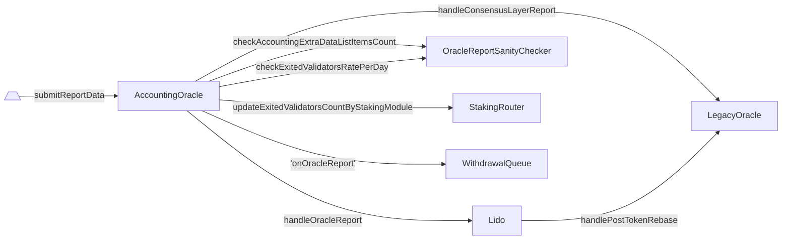

# AccountingOracle

- [Código fuente](https://github.com/lidofinance/lido-dao/blob/master/contracts/0.8.9/oracle/AccountingOracle.sol)
- [Contrato desplegado](https://etherscan.io/address/0x852deD011285fe67063a08005c71a85690503Cee)
- Hereda de [BaseOracle](https://github.com/lidofinance/lido-dao/blob/master/contracts/0.8.9/oracle/BaseOracle.sol)

:::info
Se recomienda leer [¿Qué es el mecanismo de Lido Oracle?](/guías/oracle-operator-manual#introducción) antes.
:::

## ¿Qué es AccountingOracle?

AccountingOracle es un contrato que recopila información enviada por los oráculos fuera de la cadena sobre el estado de los validadores que participan en Lido y sus saldos, la cantidad de fondos acumulados en las bóvedas del protocolo (es decir, [retiro](./withdrawal-vault) y [recompensas de la capa de ejecución](./lido-execution-layer-rewards-vault)), el número de validadores [salidos y atascados](./staking-router#exited-and-stuck-validators), el número de [solicitudes de retiro](./withdrawal-queue-erc721#request) que el protocolo puede procesar y distribuye las recompensas a los operadores de nodos.

## Ciclo de reporte

El trabajo del oráculo se delimita por períodos de tiempo iguales llamados marcos. En operación normal, los oráculos finalizan un informe en cada marco (la duración del marco es de 225 épocas de la capa de consenso de Ethereum, cada marco comienza alrededor de las 12:00 del mediodía UTC). Cada marco tiene un slot de referencia y un plazo de procesamiento. Los datos del informe se recopilan observando el estado mundial (tanto de las capas de ejecución como de consenso de Ethereum) en el momento del slot de referencia del marco (incluyendo cualquier cambio de estado realizado en ese slot), y deben procesarse antes del plazo de procesamiento del marco.

El slot de referencia para cada marco se establece en el último slot de la época que precede a la primera época del marco. El plazo de procesamiento se establece en el último slot de la última época del marco.

Vale la pena señalar que la duración del marco [puede cambiarse](./hash-consensus#setframeconfig). Y si el informe del oráculo se retrasa, no extiende el período del informe, a menos que se pierda. En este caso, el próximo informe tendrá el período del informe incrementado.

El marco incluye estas etapas:

- **Esperando:** el oráculo comienza como un [daemon](/guías/oracle-operator-manual#el-daemon-del-oráculo) y se despierta cada 12 segundos (por defecto) para encontrar el último slot finalizado, intentando colisionarlo con el slot de referencia esperado;
- **Recopilación de datos:** los oráculos monitorean el estado de ambas capas de ejecución y consenso y recopilan los datos para el slot de referencia finalizado que ha llegado con éxito;
- **Consenso de hash:** los oráculos analizan los datos, compilan el informe y envían su hash al contrato inteligente [`HashConsensus`](./hash-consensus);
- **Informe de actualización central:** una vez que se alcanza el [quórum](./hash-consensus#getquorum) de hashes, lo que significa que más de la mitad de los oráculos enviaron el mismo hash (es decir, 5 de 9 miembros del comité de oráculos en el momento de escribir), uno de los oráculos elegido a su vez envía el informe real al contrato `AccountingOracle`, lo que desencadena la actualización del estado central del protocolo, incluyendo la rebase del token, la distribución de recompensas a los operadores de nodos, la finalización de las solicitudes de retiro y la decisión del modo del protocolo: si entrar en modo búnker, y
- **Informe de datos adicionales:** un informe adicional que lleva información adicional que no es vital para la actualización central se envía a `AccountingOracle`, y puede enviarse en partes (por ejemplo, estados de claves de operadores de nodos y datos de distribución de recompensas).

:::note
Como se dijo, los informes diarios del oráculo no deben darse por sentados.
Los daemons de los oráculos podrían dejar de enviar sus informes por períodos prolongados en caso de no haber [finalidad](https://ethereum.org/en/developers/docs/consensus-mechanisms/pos/#finality) en la capa de consenso de Ethereum.
Esto resultaría en última instancia en la ausencia de informes del oráculo y en la falta de rebases de stETH durante todo ese período.
:::

## Procesamiento de informes

La [envío](./accounting-oracle#submitreportdata) del informe principal a `AccountingOracle` desencadena los siguientes procesos en orden, aunque dentro de una única transacción:

1. Actualizar el conteo de validadores salidos para cada módulo de staking en StakingRouter;
2. Actualizar el estado de modo búnker para WithdrawalQueue;
3. Manejar la función en el contrato Lido que realiza el cambio principal de estado del protocolo.
4. Almacenar información sobre ExtraData.

El diagrama muestra la interacción con los contratos.



## Datos del informe

La función `submitReportData()` acepta la siguiente estructura `ReportData`.

```solidity
struct ReportData {
    uint256 consensusVersion;
    uint256 refSlot;
    uint256 numValidators;
    uint256 clBalanceGwei;
    uint256[] stakingModuleIdsWithNewlyExitedValidators;
    uint256[] numExitedValidatorsByStakingModule;
    uint256 withdrawalVaultBalance;
    uint256 elRewardsVaultBalance;
    uint256 sharesRequestedToBurn;
    uint256[] withdrawalFinalizationBatches;
    uint256 simulatedShareRate;
    bool isBunkerMode;
    uint256 extraDataFormat;
    bytes32 extraDataHash;
    uint256 extraDataItemsCount;
}
```

**Información de consenso del oráculo**

- `consensusVersion` — Versión de las reglas de consenso del oráculo. La versión actual esperada por el oráculo puede obtenerse llamando a `getConsensusVersion()`.
- `refSlot` — Slot de referencia para el cual se calculó el informe. El estado informado debe incluir todos los cambios de estado resultantes de todos los bloques hasta este slot de referencia (inclusive). La época que contiene el slot debe estar finalizada antes de calcular el informe.

**Valores de la CL**

- `numValidators` — El número de validadores en la capa de consenso de Ethereum que alguna vez fueron depositados a través de Lido, observado en el slot de referencia.
- `clBalanceGwei` — Saldo acumulado nominado en gwei de todos los validadores de Lido en la capa de consenso de Ethereum observado en el slot de referencia.
- `stakingModuleIdsWithNewlyExitedValidators` — IDs de módulos de staking que tienen más validadores salidos que el número almacenado en el contrato del módulo de staking respectivo, observado en el slot de referencia.
- `numExitedValidatorsByStakingModule` — Número de validadores que han salido alguna vez para cada uno de los módulos de staking del array `stakingModuleIdsWithNewlyExitedValidators`, observado en el slot de referencia.

**Valores de la EL**

- `withdrawalVaultBalance` — Saldo en ether de la [bóveda de retiros](/contracts/withdrawal-vault) de Lido observado en el slot de referencia.
- `elRewardsVaultBalance` — Saldo en ether de la [bóveda de recompensas de la capa de ejecución](/contracts/lido-execution-layer-rewards-vault) de Lido observado en el slot de referencia.
- `sharesRequestedToBurn` — La cantidad de acciones solicitadas para quemar a través del [Burner](/contracts/burner) observado en el slot de referencia. El valor puede obtenerse de la siguiente manera:

```solidity
(coverSharesToBurn, nonCoverSharesToBurn) = IBurner(burner).getSharesRequestedToBurn()
sharesRequestedToBurn = coverSharesToBurn + nonCoverSharesToBurn
```

# Decisión de finalización de retiros

- `withdrawalFinalizationBatches` — Array ordenado ascendentemente de IDs de solicitudes de retiro obtenidos por el daemon del oráculo al recopilar el informe llamando a [`WithdrawalQueue.calculateFinalizationBatches`](./withdrawal-queue-erc721#calculatefinalizationbatches). Un array vacío significa que no hay solicitudes de retiro para finalizar.
- `simulatedShareRate` — La tasa de participación (es decir, [total de ether agrupado](./lido#gettotalpooledether) dividido por [total de acciones](./lido#gettotalshares)) con una precisión de 10^27 (es decir, multiplicado por 10^27) que sería efectiva como resultado de aplicar este informe del oráculo en el slot de referencia, con `withdrawalFinalizationBatches` establecido en array vacío y `simulatedShareRate` establecido en 0. Para estimar `simulatedShareRate` se debe realizar una llamada de vista [Lido.handleOracleReport](/contracts/lido#handleoraclereport) directamente a través de la API JSON-RPC [`eth_call`](https://ethereum.org/en/developers/docs/apis/json-rpc/#eth_call) y calcularlo de la siguiente manera:

```solidity
_simulatedShareRate = (postTotalPooledEther * 10**27) / postTotalShares
```

donde `postTotalPooledEther` y `postTotalShares` se recuperaron como valores de retorno de la llamada de vista realizada.

- `isBunkerMode` — Si, basado en el estado observado en el slot de referencia, el protocolo debe estar en modo búnker o en modo turbo (regular).

:::note

##### Datos adicionales

Datos adicionales — la información del oráculo que permite el procesamiento asincrónico, potencialmente en partes, después de que se procesan los datos principales. El oráculo no impone que los datos adicionales adjuntos al mismo informe de datos se procesen en su totalidad antes de que expire el plazo de procesamiento o comience a procesarse un nuevo informe de datos, pero impone que no es posible procesar datos adicionales para un informe después de que expire su plazo de procesamiento o llegue un nuevo informe de datos.

Los datos adicionales son un array de elementos, cada elemento codificado de la siguiente manera:

       3 bytes    2 bytes      X bytes
    | itemIndex | itemType | itemPayload |

- `itemIndex` es un índice basado en 0 en el array de datos adicionales;
- `itemType` es el tipo de elemento de datos adicionales;
- `itemPayload` es el dato del elemento cuya interpretación depende del tipo de elemento.

Los elementos deben estar ordenados de manera ascendente por la clave compuesta `(itemType, ...itemSortingKey)` donde el cálculo de `itemSortingKey` depende del tipo de elemento (ver más abajo).

---------------------------------------------------------------------------------------

**`itemType=0`** (`EXTRA_DATA_TYPE_STUCK_VALIDATORS`): validadores atascados por operadores de nodos.

El campo `itemPayload` tiene el siguiente formato:

    | 3 bytes  |   8 bytes    |  nodeOpsCount * 8 bytes  |  nodeOpsCount * 16 bytes  |
    | moduleId | nodeOpsCount |      nodeOperatorIds     |   stuckValidatorsCounts   |

`moduleId` es el módulo de staking para el cual se informan los conteos de claves salidas.

`nodeOperatorIds` contiene un array de IDs de operadores de nodos que tienen cambios en los conteos totales de validadores atascados en comparación con el almacenamiento del contrato inteligente del módulo de staking observado en el slot de referencia. Cada ID es un uint de 8 bytes, los IDs están empaquetados de forma compacta.

`nodeOpsCount` contiene el número de IDs de operadores de nodos contenidos en el array `nodeOperatorIds`. Así,

    nodeOpsCount = byteLength(nodeOperatorIds) / 8

`stuckValidatorsCounts` contiene un array de conteos totales de validadores atascados, observado en el slot de referencia, para los operadores de nodos del array `nodeOperatorIds`, en el mismo orden. Cada conteo es un uint de 16 bytes, los conteos están empaquetados de forma compacta. Así,

    byteLength(stuckValidatorsCounts) = nodeOpsCount * 16

`nodeOpsCount` no debe ser mayor que `maxAccountingExtraDataListItemsCount` especificado en el contrato [`OracleReportSanityChecker`](./oracle-report-sanity-checker). Si un módulo de staking tiene más operadores de nodos con cambios en los conteos totales de validadores atascados en comparación con el almacenamiento del contrato inteligente del módulo de staking (observado en el slot de referencia), los informes para ese módulo deben dividirse en múltiples elementos.

La clave de ordenación del elemento es una clave compuesta que consiste en el ID del módulo y el ID del primer operador de nodos informado:

    itemSortingKey = (moduleId, nodeOperatorIds[0:8])

---------------------------------------------------------------------------------------

**`itemType=1`** (`EXTRA_DATA_TYPE_EXITED_VALIDATORS`): validadores salidos por operadores de nodos.

El formato de carga útil es exactamente el mismo que para `itemType=EXTRA_DATA_TYPE_STUCK_VALIDATORS`, excepto que, en lugar de los conteos de validadores atascados, se informan los conteos de validadores salidos. La clave de ordenación del elemento se calcula de manera idéntica.

---------------------------------------------------------------------------------------

El daemon del oráculo debe informar los conteos de validadores salidos/atascados SOLO para aquellos pares `(moduleId, nodeOperatorId)` que contienen conteos desactualizados en el almacenamiento del contrato inteligente del módulo de staking observado en el slot de referencia.

El array de datos adicionales puede pasarse en diferentes formatos, ver más abajo.

:::

- `extraDataFormat` - Formato de los datos adicionales. Actualmente, solo se admiten los formatos `EXTRA_DATA_FORMAT_EMPTY=0` y `EXTRA_DATA_FORMAT_LIST=1`. Ver la constante que define un formato de datos específico para más información.
- `extraDataHash` - Hash de los datos adicionales. Ver la constante que define un formato de datos adicionales específico para obtener información sobre cómo calcular el hash. Debe establecerse en un hash nulo si el informe del oráculo no contiene datos adicionales.
- `extraDataItemsCount` - Número de elementos de datos adicionales. Debe establecerse en cero si el informe del oráculo no contiene datos adicionales.

## Acceso y permisos

El acceso a los métodos de palanca está restringido utilizando la funcionalidad del contrato [AccessControlEnumerable](https://github.com/lidofinance/lido-dao/blob/master/contracts/0.8.9/utils/access/AccessControlEnumerable.sol) y un conjunto de [roles granulares](#permisos).

## Constantes

### LIDO()

Devuelve una dirección del contrato [Lido](/contracts/lido)

```solidity
address public immutable LIDO
```

### LOCATOR()

Devuelve la dirección del contrato [LidoLocator](/contracts/lido-locator)

```solidity
ILidoLocator public immutable LOCATOR
```

### LEGACY_ORACLE()

Devuelve la dirección del contrato [LegacyOracle](/contracts/legacy-oracle)

```solidity
address public immutable LEGACY_ORACLE
```

### SECONDS_PER_SLOT()

Ver [https://ethereum.org/en/developers/docs/blocks/#block-time](https://ethereum.org/en/developers/docs/blocks/#block-time)

:::note
siempre devuelve 12 segundos debido a [the Merge](https://ethereum.org/en/roadmap/merge/)
:::

```solidity
uint256 public immutable SECONDS_PER_SLOT
```

### GENESIS_TIME()

Ver [https://blog.ethereum.org/2020/11/27/eth2-quick-update-no-21](https://blog.ethereum.org/2020/11/27/eth2-quick-update-no-21)

:::note
siempre devuelve 1606824023 (1 de diciembre de 2020, 12:00:23 pm UTC) en [Mainnet](https://blog.ethereum.org/2020/11/27/eth2-quick-update-no-21)
:::

```solidity
uint256 public immutable GENESIS_TIME
```

### EXTRA_DATA_TYPE_STUCK_VALIDATORS()

Este tipo lleva los detalles de los validador(es) [atascados](/contracts/staking-router#exited-and-stuck-validators).

```solidity
uint256 public constant EXTRA_DATA_TYPE_STUCK_VALIDATORS = 1
```

### EXTRA_DATA_TYPE_EXITED_VALIDATORS()

Este tipo contiene los detalles de los validador(es) [salidos](/contracts/staking-router#exited-and-stuck-validators).

```solidity
uint256 public constant EXTRA_DATA_TYPE_EXITED_VALIDATORS = 2
```

### EXTRA_DATA_FORMAT_EMPTY()

El formato de datos adicionales utilizado para significar que el informe del oráculo no contiene [datos adicionales](/contracts/accounting-oracle#datos-adicionales).

Enviado como parte de la [Fase 3](/guías/oracle-operator-manual#fase-3-envío-de-datos-adicionales-del-informe) del oráculo.

Este formato se usa cuando no hay nuevos validadores [atascados](/contracts/staking-router#exited-and-stuck-validators) o [salidos](/contracts/staking-router#exited-and-stuck-validators) en el período del informe.

```solidity
uint256 public constant EXTRA_DATA_FORMAT_EMPTY = 0
```

### EXTRA_DATA_FORMAT_LIST()

El formato de lista para el array de datos adicionales. Se utiliza cuando todo el procesamiento de datos adicionales cabe en una sola transacción.

Los datos adicionales se pasan en una sola transacción como un array de bytes que contiene todos los elementos de datos empaquetados de manera compacta.

El hash es un hash `keccak256` calculado sobre los elementos del array de bytes. El equivalente en Solidity del código de cálculo del hash sería `keccak256(array)`, donde `array` tiene el tipo `bytes`.

```solidity
uint256 public constant EXTRA_DATA_FORMAT_LIST = 1
```

## ProcessingState

```solidity
struct ProcessingState {
    uint256 currentFrameRefSlot;
    uint256 processingDeadlineTime;
    bytes32 mainDataHash;
    bool mainDataSubmitted;
    bytes32 extraDataHash;
    uint256 extraDataFormat;
    bool extraDataSubmitted;
    uint256 extraDataItemsCount;
    uint256 extraDataItemsSubmitted;
}
```

- `currentFrameRefSlot` - Slot de referencia para el marco de informes actual.
- `processingDeadlineTime` - El último tiempo en el que se pueden enviar datos para el marco de informes actual.
- `mainDataHash` - Hash de los datos del informe principal. Bytes cero si no se ha alcanzado el consenso sobre el hash para el marco de informes actual.
- `mainDataSubmitted` - Si los datos del informe principal para el marco de informes actual ya se han enviado.
- `extraDataHash` - Hash de los datos del informe adicional. Debe ser ignorado a menos que `mainDataSubmitted` sea verdadero.
- `extraDataFormat` - Formato de los datos del informe adicional para el marco de informes actual. Debe ser ignorado a menos que `mainDataSubmitted` sea verdadero.
- `extraDataSubmitted` - Número total de elementos de datos del informe adicional para el marco de informes actual. Debe ser ignorado a menos que `mainDataSubmitted` sea verdadero.
- `extraDataItemsSubmitted` - Cuántos elementos de datos del informe adicional ya se han enviado para el marco de informes actual.

## Métodos de vista

### getConsensusContract()

Devuelve la dirección de la instancia del contrato [HashConsensus](/contracts/hash-consensus) utilizada por `AccountingOracle`.

```solidity
function getConsensusContract() external view returns (address)
```

### getConsensusReport()

Devuelve el último hash del informe de consenso y los metadatos.

```solidity
function getConsensusReport() external view returns (
    bytes32 hash,
    uint256 refSlot,
    uint256 processingDeadlineTime,
    bool processingStarted
)
```

#### Returns

| Nombre                     | Tipo      | Descripción                                                                                                                                                                                                                                    |
| ------------------------ | --------- | ---------------------------------------------------------------------------------------------------------------------------------------------------------------------------------------------------------------------------------------------- |
| `hash`                   | `bytes32` | El último hash reportado                                                                                                                                                                                                                       |
| `refSlot`                | `uint256` | El slot de referencia del marco: si los datos sobre los cuales se está alcanzando el consenso incluyen o dependen de algún estado on-chain, este estado debe consultarse en el slot de referencia. El estado reportado debe incluir todos los cambios de estado resultantes de todos los bloques hasta este slot de referencia (inclusive). |
| `processingDeadlineTime` | `uint256` | Marca de tiempo del último slot en el cual un informe puede ser reportado y procesado                                                                                                                                                          |
| `processingStarted`      | `bool`    | Indica si se ha iniciado o no el procesamiento del informe                                                                                                                                                                                     |

### getConsensusVersion()

Devuelve la versión actual de consenso esperada por el contrato del oráculo.

:::note
La versión de consenso debe cambiar cada vez que cambian las reglas de consenso, lo que significa que un oráculo que observa el mismo slot de referencia calcularía un hash diferente.
:::

```solidity
function getConsensusVersion() external view returns (uint256)
```

### getContractVersion()

Devuelve la versión actual del contrato.

```solidity
function getContractVersion() public view returns (uint256)
```

### getLastProcessingRefSlot()

Devuelve el último slot de referencia para el cual se inició el procesamiento del informe.

```solidity
function getLastProcessingRefSlot() external view returns (uint256)
```

### getProcessingState()

Devuelve el estado del procesamiento de datos para el marco de informes actual. Ver la documentación para la estructura [ProcessingState](#processingstate).

```solidity
function getProcessingState() external view returns (ProcessingState memory result)
```

## Métodos

### submitReportData()

Envía los datos del informe para su procesamiento.

```solidity
function submitReportData(ReportData calldata data, uint256 contractVersion)
```

#### Parámetros

| Nombre            | Tipo         | Descripción                                                                                           |
| ----------------- | ------------ | ----------------------------------------------------------------------------------------------------- |
| `data`            | `ReportData` | Los datos. Ver la documentación de la estructura [ReportData](./accounting-oracle#datos-del-informe) para más detalles. |
| `contractVersion` | `uint256`    | Versión esperada del contrato del oráculo.                                                            |

#### Reverts

Para más información sobre reverts, ver una sección separada [aquí](#reverts-3)

### submitReportExtraDataEmpty()

Dispara el procesamiento requerido cuando no hay datos adicionales presentes en el informe, es decir, cuando el formato de datos adicionales es igual a EXTRA_DATA_FORMAT_EMPTY.

```solidity
function submitReportExtraDataEmpty()
```

#### Reverts

- Reviértese con `SenderNotAllowed()` si el remitente no tiene un rol `SUBMIT_DATA_ROLE` y el remitente no es un miembro del consenso.

### submitReportExtraDataList()

Envía los datos adicionales del informe en el formato EXTRA_DATA_FORMAT_LIST para su procesamiento.

```solidity
function submitReportExtraDataList(bytes calldata items)
```

#### Parámetros

| Nombre  | Tipo    | Descripción                                                                                               |
| ------- | ------- | --------------------------------------------------------------------------------------------------------- |
| `items` | `bytes` | La lista de elementos de datos adicionales. Ver la documentación para la constante [EXTRA_DATA_FORMAT_LIST](#extra_data_format_list) para más detalles. |

#### Reverts

- Reviértese con `SenderNotAllowed()` si el remitente no tiene un rol `SUBMIT_DATA_ROLE` y el remitente no es un miembro del consenso.

### submitConsensusReport()

Llamado por el contrato [AccountingOracle HashConsensus](/contracts/hash-consensus) para enviar un informe de consenso para su procesamiento.

:::note
Tenga en cuenta que enviar el informe no requiere que el procesador comience a procesarlo de inmediato, esto puede suceder más tarde (ver [`getLastProcessingRefSlot`](#getlastprocessingrefslot)). Hasta que se inicie el procesamiento, HashConsensus es libre de alcanzar el consenso sobre otro informe para el mismo marco de informes y enviarlo usando esta misma función, o perder el consenso sobre el informe enviado, notificando al procesador a través de `discardConsensusReport`.
:::

```solidity
function submitConsensusReport(bytes32 reportHash, uint256 refSlot, uint256 deadline)
```

#### Parámetros

| Nombre       | Tipo      | Descripción                                                                                             |
| ------------ | --------- | ------------------------------------------------------------------------------------------------------- |
| `reportHash` | `bytes32` | Hash de los datos calculados para el slot de referencia dado.                                           |
| `refSlot`    | `uint256` | El slot de referencia para el cual se calcularon los datos. Revierte si no coincide con el slot de referencia actual. |
| `deadline`   | `uint256` | La marca de tiempo del último slot en el cual el informe puede ser procesado por el contrato de procesamiento de informes. |

### discardConsensusReport()

Llamado por el contrato HashConsensus para notificar que el informe para el slot de referencia dado
 ya no es un informe de consenso y debe ser descartado. Esto puede suceder cuando un miembro
 cambia su informe, es removido del conjunto, o cuando se incrementa el valor del quórum.

Solo se llama cuando, para el slot de referencia dado:

1. Anteriormente hubo un informe de consenso; Y
2. El procesamiento del informe de consenso no ha comenzado aún; Y
3. La fecha límite para el procesamiento del informe no ha expirado aún; Y
4. Actualmente no hay un informe de consenso (de lo contrario, se llama a [submitConsensusReport](#submitconsensusreport)).

Puede ser llamado incluso cuando no hay un informe de consenso no descartado presentado para el slot de referencia actual, es decir, puede ser llamado múltiples veces sucesivamente.

```solidity
function discardConsensusReport(uint256 refSlot)
```

### setConsensusContract()

```solidity
function setConsensusContract(address addr)
```

### setConsensusVersion()

Establece la versión de consenso esperada por el contrato del oráculo.

```solidity
function setConsensusVersion(uint256 version)
```

## Permisos

### SUBMIT_DATA_ROLE()

Un rol de ACL que otorga permiso para enviar los datos para un informe del comité.

```solidity
bytes32 public constant SUBMIT_DATA_ROLE = keccak256("SUBMIT_DATA_ROLE");
```

### MANAGE_CONSENSUS_CONTRACT_ROLE()

Un rol de ACL que otorga permiso para establecer la dirección del contrato de consenso llamando a setConsensusContract.

```solidity
bytes32 public constant MANAGE_CONSENSUS_CONTRACT_ROLE = keccak256("MANAGE_CONSENSUS_CONTRACT_ROLE");
```

### MANAGE_CONSENSUS_VERSION_ROLE()

Un rol de ACL que otorga permiso para establecer la versión de consenso llamando a setConsensusVersion.

```solidity
bytes32 public constant MANAGE_CONSENSUS_VERSION_ROLE = keccak256("MANAGE_CONSENSUS_VERSION_ROLE");
```

## Eventos

### ExtraDataSubmitted()

Se emite cuando se han enviado datos adicionales para el marco de informes actual.

```solidity
ExtraDataSubmitted(uint256 indexed refSlot, uint256 itemsProcessed, uint256 itemsCount)
```

### WarnExtraDataIncompleteProcessing()

Se emite cuando se intenta enviar el mismo informe, pero aún no se han procesado todos los elementos.

```solidity
event WarnExtraDataIncompleteProcessing(
    uint256 indexed refSlot,
    uint256 processedItemsCount,
    uint256 itemsCount
)
```

### ConsensusHashContractSet()

Se emite cuando se cambia el valor del hash del contrato.

```solidity
event ConsensusHashContractSet(address indexed addr, address indexed prevAddr)
```

### ConsensusVersionSet()

Se emite cuando se cambia el valor de la versión de consenso.

```solidity
event ConsensusVersionSet(uint256 indexed version, uint256 indexed prevVersion)
```

### ReportSubmitted()

Se emite cuando se envía un nuevo hash de informe de consenso

```solidity
event ReportSubmitted(uint256 indexed refSlot, bytes32 hash, uint256 processingDeadlineTime)
```

### ReportDiscarded()

Se emite cuando se descarta un informe de consenso.

```solidity
event ReportDiscarded(uint256 indexed refSlot, bytes32 hash)
```

### ProcessingStarted()

Se emite cuando se envían datos de informe

```solidity
event ProcessingStarted(uint256 indexed refSlot, bytes32 hash)
```

### WarnProcessingMissed()

Se emite en [submitConsensusReport](#submitconsensusreport) cuando `refSlot != prevSubmittedRefSlot && prevProcessingRefSlot != prevSubmittedRefSlot`

```solidity
event WarnProcessingMissed(uint256 indexed refSlot)
```

## Reverts

### submitReportData()

Para asegurarse de que los datos reportados están dentro de los valores posibles, la función manejadora realiza una serie de comprobaciones de sanidad. Al comprobar, pueden ocurrir reverts en diferentes contratos.

#### Contratos AccountingOracle y BaseOracle

- Revierte con `SenderNotAllowed()` si el llamador no tiene un rol `SUBMIT_DATA_ROLE` y no es un miembro del comité del oráculo.
- Revierte con `UnexpectedContractVersion(expectedVersion, version)` si la versión del contrato proporcionada es diferente de la actual.
- Revierte con `UnexpectedConsensusVersion(expectedConsensusVersion, consensusVersion)` si la versión de consenso proporcionada es diferente de la esperada.
- Revierte con `UnexpectedRefSlot(report.refSlot, refSlot)` si el slot de referencia proporcionado difiere del del marco de consenso actual.
- Revierte con `UnexpectedDataHash(report.hash, hash)` si el hash keccak256 de los datos codificados en ABI es diferente del último hash.
- Revierte con `NoConsensusReportToProcess()` si los datos del hash del informe son 0.
- Revierte con `RefSlotAlreadyProcessing()` si el slot de referencia del informe es igual al slot de referencia de procesamiento previo.
- Revierte con `UnexpectedExtraDataHash(bytes32(0), data.extraDataHash)` si `data.extraDataFormat` es `EXTRA_DATA_FORMAT_EMPTY` y `data.extraDataHash` es 0.
- Revierte con `UnexpectedExtraDataItemsCount(0, data.extraDataItemsCount)` si `data.extraDataFormat` es `EXTRA_DATA_FORMAT_EMPTY` y `data.extraDataItemsCount` no es 0.
- Revierte con `UnsupportedExtraDataFormat(data.extraDataFormat)` si `data.extraDataFormat` no es `EXTRA_DATA_FORMAT_EMPTY` y no es `EXTRA_DATA_FORMAT_LIST`.
- Revierte con `ExtraDataItemsCountCannotBeZeroForNonEmptyData()` si `data.extraDataFormat` es `EXTRA_DATA_FORMAT_LIST` y `data.extraDataItemsCount` es 0.
- Revierte con `ExtraDataHashCannotBeZeroForNonEmptyData()` si `data.extraDataFormat` es `EXTRA_DATA_FORMAT_LIST` y `data.extraDataHash` es 0.
- Revierte con `InvalidExitedValidatorsData()` si los datos de validadores salientes proporcionados no cumplen con las comprobaciones de seguridad.

#### OracleReportSanityChecker

- Revierte con el error `MaxAccountingExtraDataItemsCountExceeded(uint256 maxItemsCount, uint256 receivedItemsCount)` cuando la comprobación falla, más información [aquí](/contracts/oracle-report-sanity-checker.md#checkaccountingextradatalistitemscount)
- Revierte con `ExitedValidatorsLimitExceeded(uint256 limitPerDay, uint256 exitedPerDay)` si los datos de validadores salientes proporcionados no cumplen con las comprobaciones de seguridad. (OracleReportSanityChecker)

#### StakingRouter

- Revierte con `ArraysLengthMismatch(_stakingModuleIds.length, _exitedValidatorsCounts.length)` si los datos de validadores salientes proporcionados no cumplen con las comprobaciones de seguridad. (StakingRouter)
- Revierte con `ExitedValidatorsCountCannotDecrease()` si los datos de validadores salientes proporcionados no cumplen con las comprobaciones de seguridad. (StakingRouter)
- Revierte con `ReportedExitedValidatorsExceedDeposited(uint256 reportedExitedValidatorsCount,uint256 depositedValidatorsCount)` si los datos de validadores salientes proporcionados no cumplen con las comprobaciones de seguridad. (StakingRouter)

Otras reverts en `Lido.handleOracleReport()`