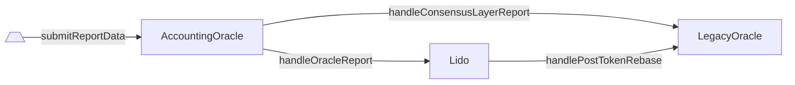

# LegacyOracle

- [Código fuente](https://github.com/lidofinance/lido-dao/blob/master/contracts/0.4.24/oracle/LegacyOracle.sol)
- [Contrato desplegado](https://etherscan.io/address/0x442af784A788A5bd6F42A01Ebe9F287a871243fb)

:::warning
`LegacyOracle` se mantendrá hasta finales de 2023.
Después de ese período, será descontinuado y las integraciones externas deberán depender de [`AccountingOracle`](/contracts/accounting-oracle).
:::

## ¿Qué es LegacyOracle?

`LegacyOracle` es una aplicación de Aragon previamente conocida como `LidoOracle`, utilizada para rastrear cambios en la Beacon Chain.
Tras la actualización a Lido V2, esto fue reemplazado por [`AccountingOracle`](/contracts/accounting-oracle)
y el flujo del oráculo fue rediseñado para entregar fragmentos de datos históricos sincronizados para el mismo slot de referencia
tanto para las partes de Capa de Consenso como de Ejecución.

## Cambios clave

En Lido V2, `LegacyOracle` solo soporta un subconjunto de funciones de vista y eventos.
`AccountingOracle` interactúa con él para enviar cambios de datos en cada reporte.

### ¿Cómo recibe LegacyOracle los reportes de AccountingOracle de todos modos? (flujo)

El contrato `LegacyOracle` recibe los cambios de datos en cada reporte de `AccountingOracle` usando dos etapas
(aún dentro de la misma transacción):

1. Invoca [`handleConsensusLayerReport`](./legacy-oracle#handleconsensuslayerreport)
   proporcionando el slot de referencia y los datos de los validadores del `AccountingOracle` en sí mismo.
1. Invoca [`handlePostTokenRebase`](./legacy-oracle#handleposttokenrebase)
   desde [`Lido`](/contracts/lido).



### Rebase y APR

Para calcular las proyecciones diarias de rebase y APR del protocolo, se usarían las API antiguas de `LidoOracle` durante un tiempo.
Aunque la antigua forma de calcular el APR seguiría dando números relevantes, las matemáticas podrían no ser precisas en caso de retiros significativos.

#### Cómo era con LidoOracle

:::note
La fórmula está desactualizada e inexacta desde la [actualización a Lido V2](https://blog.lido.fi/lido-v2-launch/).
:::

```javascript
protocolAPR = ((postTotalPooledEther - preTotalPooledEther) * secondsInYear) / (preTotalPooledEther * timeElapsed)
lidoFeeAsFraction = lidoFee / basisPoint
userAPR = protocolAPR * (1 - lidoFeeAsFraction)
```

#### Lo nuevo desde Lido V2

Consulte la nueva documentación de la API de Lido con respecto a [APR](/docs/integrations/api.md#lido-apr).

```js
// Se emite cuando se reajusta el token (se cambió el suministro total y/o las acciones totales)
event TokenRebased(
    uint256 indexed reportTimestamp,
    uint256 timeElapsed,
    uint256 preTotalShares,
    uint256 preTotalEther, /* preTotalPooledEther */
    uint256 postTotalShares,
    uint256 postTotalEther, /* postTotalPooledEther */
    uint256 sharesMintedAsFees /* parte de la tarifa incluida en `postTotalShares` */
);

preShareRate = preTotalEther * 1e27 / preTotalShares
postShareRate = postTotalEther * 1e27 / postTotalShares

userAPR =
    secondsInYear * (
        (postShareRate - preShareRate) / preShareRate
    ) / timeElapsed
```

En resumen, la nueva fórmula tiene en cuenta tanto los valores de `preTotalShares` como `postTotalShares`, mientras que,
en contraste, la fórmula antigua no los utilizaba. La nueva fórmula tampoco requiere calcular `lidoFee`
en absoluto (porque la distribución de tarifas funciona cambiando la cantidad total de acciones bajo el capó).

#### ¿Por qué es importante?

Cuando el protocolo Lido V2 finaliza las solicitudes de retiro, el contrato `Lido` envía ether a la `WithdrawalQueue` (excluyendo estos fondos de `totalPooledEther`, es decir, disminuyendo el TVL) y asigna para quemar acciones subyacentes bloqueadas en las solicitudes `stETH`.

En otras palabras, la finalización del retiro disminuye tanto el TVL como las acciones totales.

La fórmula antigua ya no es adecuada porque captura cambios en el TVL, pero omite cambios en las acciones totales.

Ejemplo ilustrativo (usando números pequeños para simplicidad):

```javascript
preTotalEther = 1000 ETH
preTotalShares = 1000 * 10^18 // 1 acción : 1 wei

postTotalEther = 999 ETH
postTotalShares = 990 * 10^18

timeElapsed = 24 * 60 * 60 // 1 día, o 86400 segundos

//!!! usando el método antiguo (impreciso)

// protocolAPR = (postTotalPooledEther - preTotalPooledEther) * secondsInYear / (preTotalPooledEther * timeElapsed)
protocolAPR = (999ETH - 1000ETH) * 31557600 / (1000ETH * 86400) = -0.36525
//lidoFeeAsFraction = lidoFee / basisPoint = 0.1
//userAPR = protocolAPR * (1 - lidoFeeAsFraction) = protocolAPR * (1 - 0.1)

userAPR = -0.36525 * (1 - 0.1) = -0.328725

//!!! es decir, userAPR ahora es ~menos 32.9%

//!!! usando el método actualizado (correcto)

preShareRate = 1000 ETH * 1e27 / 1000 * 10^18 = 1e27
postShareRate = 999 ETH * 1e27 / 990 * 10^18 = 1.009090909090909e+27
userAPR = 31557600 * ((postShareRate - preShareRate) / preShareRate) / 86400 = 3.320454545454529

//!!! es decir, userAPR ahora es ~más 332%
```

## Métodos de vista

### getLido()

Devuelve la dirección del contrato `Lido`.

```sol
function getLido() returns (address)
```

:::note
Siempre devuelve la dirección de `Lido` indicada en la lista de [contratos desplegados](/deployed-contracts).
:::

### getAccountingOracle()

Devuelve la dirección del contrato `AccountingOracle`.

```sol
function getAccountingOracle() returns (address)
```

:::note
Siempre devuelve la dirección de `AccountingOracle` indicada en la lista de [contratos desplegados](/deployed-contracts).
:::

### getContractVersion()

Devuelve la versión actual del contrato.

```sol
function getContractVersion() returns (uint256)
```

:::note
Siempre devuelve `4`.
:::

### getVersion()

Devuelve la versión actual del contrato (método de compatibilidad).

```sol
function getVersion() returns (uint256)
```

:::note
Siempre devuelve `4`, llama internamente a `getContractVersion()`.
:::

### getBeaconSpec()

Devuelve el período de marco de `AccountingOracle` junto con las constantes de especificación de Ethereum Beacon Chain.

```sol
function getBeaconSpec() returns (
    uint64 epochsPerFrame,
    uint64 slotsPerEpoch,
    uint64 secondsPerSlot,
    uint64 genesisTime
)
```

:::note
Siempre devuelve (225, 32, 12, 1606824023) para Mainnet y (225, 32, 12, 1616508000) para Görli.
:::

#### Devoluciones

| Nombre           | Tipo     | Descripción                                                       |
| ---------------- | -------- | ----------------------------------------------------------------- |
| `epochsPerFrame` | `uint64` | Épocas de Beacon Chain por marco de reporte de `AccountingOracle` |
| `slotsPerEpoch`  | `uint64` | Slots de Beacon Chain por época de Beacon Chain                   |
| `secondsPerSlot` | `uint64` | Segundos por slot de Beacon Chain                                 |
| `genesisTime`    | `uint64` | Marca de tiempo de génesis de Beacon Chain                        |

### getCurrentEpochId()

Devuelve el ID de época de

Beacon Chain calculado a partir del timestamp actual usando la [especificación de cadena de Beacon](./legacy-oracle#getbeaconspec).

```sol
function getCurrentEpochId() returns (uint256)
```

### getCurrentFrame()

Devuelve la primera época del marco actual de reporte de `AccountingOracle` así como sus tiempos de inicio y fin en segundos.

```sol
function getCurrentFrame() returns (
    uint256 frameEpochId,
    uint256 frameStartTime,
    uint256 frameEndTime
)
```

#### Devoluciones

| Nombre           | Tipo      | Descripción                                                        |
| ---------------- | --------- | ------------------------------------------------------------------ |
| `frameEpochId`   | `uint256` | La primera época del marco de reporte actual de `AccountingOracle` |
| `frameStartTime` | `uint256` | El timestamp de inicio del marco de reporte actual                 |
| `frameEndTime`   | `uint256` | El timestamp de fin del marco de reporte actual                    |

### getLastCompletedEpochId()

Devuelve la época de inicio del último marco en el que se recibió y aplicó el último reporte de `AccountingOracle`.

```sol
function getLastCompletedEpochId() returns (uint256)
```

### getLastCompletedReportDelta()

Devuelve el cambio en el suministro total ocurrido con el último reporte completado de `AccountingOracle`.

```sol
function getLastCompletedReportDelta() returns (
    uint256 postTotalPooledEther,
    uint256 preTotalPooledEther,
    uint256 timeElapsed
)
```

#### Devoluciones

| Nombre                 | Tipo      | Descripción                                                         |
| ---------------------- | --------- | ------------------------------------------------------------------- |
| `postTotalPooledEther` | `uint256` | `stETH` total pooled ether post-report (es decir, suministro total) |
| `preTotalPooledEther`  | `uint256` | `stETH` total pooled ether pre-report (es decir, suministro total)  |
| `timeElapsed`          | `uint256` | Tiempo transcurrido desde el último reporte completado, segundos    |

## Métodos

### handlePostTokenRebase()

Maneja un reajuste del token `stETH` incurrido por el reporte exitoso de `AccountingOracle` almacenando
las estadísticas de ether total y tiempo transcurrido.

Emite [`PostTotalShares`](./legacy-oracle#posttotalshares)

```sol
function handlePostTokenRebase(
    uint256 reportTimestamp,
    uint256 timeElapsed,
    uint256 preTotalShares,
    uint256 preTotalEther,
    uint256 postTotalShares,
    uint256 postTotalEther,
    uint256 totalSharesMintedAsFees
)
```

:::note
El llamante debe ser `Lido`.
:::

#### Parámetros

| Nombre                    | Tipo      | Descripción                                                                                         |
| ------------------------- | --------- | --------------------------------------------------------------------------------------------------- |
| `reportTimestamp`         | `uint256` | El timestamp de referencia correspondiente al momento del cálculo del reporte del oráculo           |
| `timeElapsed`             | `uint256` | Tiempo transcurrido desde el último reporte completado, segundos                                    |
| `preTotalShares`          | `uint256` | `stETH` total shares pre-report                                                                     |
| `preTotalEther`           | `uint256` | `stETH` total pooled ether pre-report (es decir, suministro total)                                  |
| `postTotalShares`         | `uint256` | `stETH` total shares post-report                                                                    |
| `postTotalEther`          | `uint256` | `stETH` total pooled ether post-report (es decir, suministro total)                                 |
| `totalSharesMintedAsFees` | `uint256` | Cantidad total de acciones acuñadas como tarifas del protocolo además de las recompensas acumuladas |

### handleConsensusLayerReport()

Maneja un nuevo reporte completado de `AccountingOracle` almacenando el ID de época correspondiente de Beacon Chain.

Emite [`Completed`](./legacy-oracle#completed).

```sol
function handleConsensusLayerReport(
    uint256 _refSlot,
    uint256 _clBalance,
    uint256 _clValidators
)
```

:::note
El llamante debe ser `AccountingOracle`.
:::

#### Parámetros

| Nombre          | Tipo      | Descripción                                                                          |
| --------------- | --------- | ------------------------------------------------------------------------------------ |
| `_refSlot`      | `uint256` | El slot de referencia correspondiente al momento del cálculo del reporte del oráculo |
| `_clBalance`    | `uint256` | Balance de validadores participantes de Lido en el lado de Beacon Chain              |
| `_clValidators` | `uint256` | Número de validadores participantes de Lido en el lado de Beacon Chain               |

## Eventos

### Completed()

Se emite cada vez que se recibe el reporte de `AccountingOracle`.

Este evento todavía se emite después de que el comité del oráculo llega a un consenso sobre un reporte, pero solo por compatibilidad.
Los valores en este evento ya no son suficientes para calcular APR o TVL debido a los retiros, recompensas de Capa de Ejecución y recompensas de Capa de Consenso.

```solidity
event Completed(
    uint256 epochId,
    uint128 beaconBalance,
    uint128 beaconValidators
);
```

:::note
Se emite dentro de los métodos [`handleConsensusLayerReport`](./legacy-oracle#handleconsensuslayerreport).
:::

#### Parámetros

| Nombre             | Tipo      | Descripción                                                                |
| ------------------ | --------- | -------------------------------------------------------------------------- |
| `epochId`          | `uint256` | Identificador de época de referencia del reporte                           |
| `beaconBalance`    | `uint128` | El balance de los validadores participantes de Lido en el lado de Consenso |
| `beaconValidators` | `uint128` | El número de los validadores participantes de Lido que han aparecido       |

### PostTotalShares()

Se emite cada vez que se recibe el reporte de `AccountingOracle`.

Este evento todavía se emite después de cada reajuste, pero solo por compatibilidad. Los valores en este evento no son suficientes para calcular correctamente el APR del reajuste, ya que un reajuste puede resultar de la quema de acciones sin cambiar el total de ETH en posesión del protocolo.

```solidity
event PostTotalShares(
    uint256 postTotalPooledEther,
    uint256 preTotalPooledEther,
    uint256 timeElapsed,
    uint256 totalShares
)
```

:::note
El nuevo evento [`TokenRebased`](/docs/integrations/api.md#ultimo-apr-de-lido-para steth) emitido desde el contrato principal de Lido debería utilizarse en su lugar porque proporciona el total de acciones previas al reporte, que es esencial para estimar correctamente un reajuste del token y su APR proyectado.
:::

#### Parámetros

| Nombre                 | Tipo      | Descripción                                             |
| ---------------------- | --------- | ------------------------------------------------------- |
| `postTotalPooledEther` | `uint256` | Ether total post-report (es decir, suministro total)    |
| `preTotalPooledEther`  | `uint256` | Ether total pre-report (es decir, suministro total)     |
| `timeElapsed`          | `uint256` | Tiempo transcurrido desde el reporte anterior, segundos |
| `totalShares`          | `uint256` | Acciones totales post-report                            |
