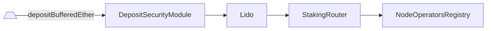
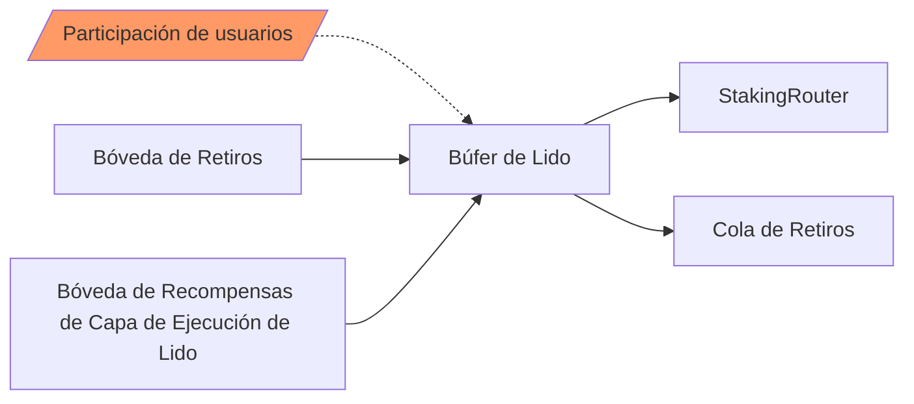

# Lido

- [Código fuente](https://github.com/lidofinance/lido-dao/blob/master/contracts/0.4.24/Lido.sol)
- [Contrato desplegado](https://etherscan.io/address/0xae7ab96520de3a18e5e111b5eaab095312d7fe84)

Lido es un grupo de staking líquido y un token relacionado con [ERC-20](https://eips.ethereum.org/EIPS/eip-20) rebaseado (`stETH`).

## ¿Qué es Lido?

Lido es un grupo de staking líquido y el contrato central responsable de:

- aceptar la participación de los usuarios, almacenarla en búfer y emitir cantidades respectivas del token líquido
- realizar una contabilidad adecuada basada en informes de oráculos recibidos y el estado actual del protocolo
- recolectar retiros, tarifas prioritarias y MEV de bóvedas respectivas hacia el búfer
- aplicar tarifas y distribuir recompensas
- transferir ether almacenado al [StakingRouter](/contracts/staking-router) o [WithdrawalQueueERC721](/contracts/withdrawal-queue-erc721)

Además, Lido es un token rebaseado [ERC-20](https://eips.ethereum.org/EIPS/eip-20), que representa ether en staking, `stETH`. Los tokens se emiten al enviar ether y se queman al ser redimidos. Los saldos de los titulares de `stETH` se actualizan diariamente con informes de oráculos.
También implementa las extensiones de permiso [ERC-2612](https://eips.ethereum.org/EIPS/eip-2612) y validación de firma [ERC-1271](https://eips.ethereum.org/EIPS/eip-1271).

Otros contratos están vinculados al núcleo y tienen las siguientes responsabilidades:

- [`LidoLocator`](./lido-locator.md): libro de direcciones del protocolo que contiene referencias a todas las partes significativas del protocolo Lido en cadena
- [`WithdrawalQueueERC721`](./withdrawal-queue-erc721.md): cola de solicitudes de retiro FIFO y un NFT respectivo (unstETH)
- [`StakingRouter`](./staking-router.md): centro que gestiona módulos de staking y distribuye la participación entre ellos
- [`NodeOperatorsRegistry`](./node-operators-registry.md): módulo original, responsable de gestionar el conjunto curado de operadores de nodos
- [`OracleReportSanityChecker`](./oracle-report-sanity-checker.md): ayudante para la validación de parámetros de informes de oráculos y suavizado de rebases de tokens
- [`Burner`](./burner.md): bóveda para contener `stETH` que deben ser quemados en informes de oráculos
- [`WithdrawalVault`](./withdrawal-vault.md): bóveda para recolectar retiros parciales y completos provenientes de Beacon Chain
- [`LidoExecutionLayerRewardsVault`](./lido-execution-layer-rewards-vault.md): bóveda para recolectar tarifas prioritarias y recompensas MEV provenientes de validadores del grupo
- [`DepositSecurityModule`](./deposit-security-module.md): protección contra vulnerabilidades de frontrunning en depósitos
- [`AccountingOracle`](./accounting-oracle.md): comité de oráculos que recopila un informe contable para el protocolo
- [`EIP712StETH`](./eip712-steth.md): ayudante ad hoc para implementar el permiso ERC-2612 para el contrato Lido de Solidity 0.4.24

## Participación

El contrato Lido es el punto de entrada principal para los stakers. Para participar en el grupo, un usuario puede enviar ETH a la dirección del contrato y se emitirán tokens `stETH` en la misma cantidad a la dirección del remitente. El ether enviado se acumula en el búfer y puede transferirse a [`WithdrawalQueueERC721`](./withdrawal-queue-erc721.md) para cumplir con las solicitudes de retiro o a [`StakingRouter`](./staking-router.md) para depositarlo como una nueva participación de validador.

Para retirar el ether subyacente, un usuario puede usar el contrato [`WithdrawalQueueERC721`](./withdrawal-queue-erc721.md) o intercambiar el token en el mercado secundario (puede ser una alternativa más económica y rápida).

## Depósito

El ether enviado por el usuario se almacena en el búfer y puede usarse más tarde para retiros o transferirse a [`StakingRouter`](./staking-router.md) para ser utilizado como depósitos de validador. Esto ocurre de manera asincrónica y utiliza [`DepositSecurityModule`](./deposit-security-module.md) como guardia para prevenir vulnerabilidades de frontrunning en depósitos.



## Redención

El token puede ser redimido por ether a través del protocolo utilizando el contrato [`WithdrawalQueueERC721`](./withdrawal-queue-erc721.md), aprovechando los [retiros de staking](https://ethereum.org/en/staking/withdrawals/) habilitados con el hardfork de Ethereum Shanghai/Capella (también conocido como "Shapella").

## Rebase

Cuando ocurre un informe de oráculo, la oferta del token se aumenta o disminuye algorítmicamente, basándose en recompensas de staking (o penalizaciones por slashing) en Beacon Chain, recompensas de capa de ejecución (a partir del [Merge](https://ethereum.org/en/upgrades/merge/) en Ethereum) o solicitudes de retiro cumplidas (a partir de [Lido V2](https://blog.lido.fi/introducing-lido-v2/)). Un rebase ocurre cuando los informes de oráculos incluyen estadísticas de Beacon.

El mecanismo de rebase se implementa a través del concepto de "shares". En lugar de almacenar un mapa con saldos de cuentas, Lido guarda qué parte del pool total es propiedad de cada cuenta. El saldo de una cuenta se calcula de la siguiente manera:

```js
balanceOf(cuenta) = shares[cuenta] * ether total en búfer / totalShares
```

- `shares` - mapa de participaciones de cuentas de usuario. Cada vez que un usuario deposita ether, se convierte en shares y se suma a la cantidad actual de shares del usuario.
- `totalShares` - la suma de shares de todas las cuentas en el mapa `shares`
- `ether total en búfer` - suma de tres tipos de ether propiedad del protocolo:

  - balance en búfer - ether almacenado en el contrato y que aún no se ha depositado ni bloqueado para retiros
  - balance transitorio - ether enviado al contrato oficial de Depósito pero que aún no es visible en el estado del beacon
  - balance del beacon - la cantidad total de ether en las cuentas de validadores. Este valor es reportado por los oráculos y tiene el mayor impacto en el cambio total de la oferta de stETH

Por ejemplo, supongamos que tenemos:

```js
totalShares = 5
ether total en búfer = 10 ETH
shares de Alice -> 1
shares de Bob -> 4
```

Entonces:

```js
balanceOf(Alice) -> 2 tokens que corresponden a 2 ETH
balanceOf(Bob) -> 8 tokens que corresponden a 8 ETH
```

En cada rebase, `ether total en búfer` normalmente aumenta, lo que indica que algunos validadores han ganado recompensas que deben distribuirse, por lo que el saldo del usuario aumenta automáticamente, a pesar de que sus shares permanecen como estaban.

```js
ether total en búfer = 15 ETH
// balance del usuario incrementado
balanceOf(Alice) -> 3 tokens que corresponden a 3 ETH ahora
balanceOf(Bob) -> 12 tokens que corresponden a 12 ETH ahora
// shares siguen siendo los mismos
shares de Alice -> 1
shares de Bob -> 4
```

:::note

Dado que los saldos de todos los titulares de tokens cambian cuando cambia la cantidad total de ether en búfer, este token no puede implementar completamente el estándar ERC-20: solo emite eventos `Transfer` al realizar transferencias explícitas entre titulares. En contraste, cuando aumenta la cantidad total de ether en búfer, no se generan eventos `Transfer`: hacerlo requeriría emitir un evento para cada titular de token y, por lo tanto, ejecutar un bucle sin límites.

:::

## Informe de Oráculo

Uno de los pilares del protocolo Lido es el informe de oráculo, que generalmente (aunque no está garantizado) proporciona al protocolo, una vez al día, datos que no pueden ser fácilmente accedidos en cadena, pero que son necesarios para una contabilidad precisa. Incluye estadísticas de Beacon Chain, así como valores correspondientes del lado de ejecución (EL) que son válidos en el bloque de reporte y los datos de decisión necesarios para cumplir con las solicitudes pendientes de retiro.

- Estadísticas de Beacon Chain:
  - el número total de validadores gestionados por el grupo
  - el balance total de los validadores gestionados por el grupo
- Valores históricos de EL:
  - balance de la bóveda de retiros
  - balance de la bóveda de recompensas de capa de ejecución
  - balance de las participaciones de stETH de Burner
- Datos relacionados con retiros:
  - solicitudes en la cola para ser finalizadas
  - tasa de participación a utilizar para la finalización

El informe de oráculo se procesa en 9 simples pasos:

1. Memorizar el pre-estado que será necesario para actualizaciones incrementales del balance del protocolo.
2. Validar los datos del informe usando [`OracleReportSanityChecker`](./oracle-report-sanity-checker.md).
3. Calcular la cantidad de ether a bloquear en [`WithdrawalQueueERC721`](./withdrawal-queue-erc721.md) y mover la cantidad respectiva de participaciones a quemar a [`Burner`](./burner.md).
4. Utilizando [`OracleReportSanityChecker`](./oracle-report-sanity-checker.md), calcular las cantidades de ether que se pueden retirar de [`LidoExecutionLayerRewardsVault`](./lido-execution-layer-rewards-vault.md) y [`WithdrawalVault`](./withdrawal-vault.md), así como el número de participaciones que se pueden quemar de [`Burner`](./burner.md) para evitar el frontrunning fácil.
5. Recolectar las cantidades calculadas de ether de las bóvedas y proceder con la finalización de las solicitudes de retiro: enviar el ether solicitado a [`WithdrawalQueue`](./withdrawal-queue-erc721.md).
6. Quemar las participaciones previamente solicitadas de [`Burner`](./burner.md) para retiros o aplicación de cobertura.
7. Distribuir recompensas y tarifas del protocolo, creando nuevos stETH para las partes respectivas.
8. Completar el rebase del token informando a los observadores (emitir un evento y llamar a los receptores externos si los hay).
9. Verificación de cordura posterior al informe para la tasa de participación proporcionada con el informe.



Así, el resultado observable del informe para el protocolo es el siguiente:

- se cumplen las solicitudes de retiro en la cola
- se recolecta ether de las bóvedas de retiro y recompensas de EL en el búfer
- el balance de CL se actualiza según el informe
- se distribuyen las recompensas entre stakers, módulos de staking y tesorería del protocolo

## Estándares

El contrato implementa los siguientes estándares de Ethereum:

- [ERC-20: Estándar de Token](https://eips.ethereum.org/EIPS/eip-20)
- [ERC-2612: Extensión de Permiso para Aprobaciones Firmadas ERC-20](https://eips.ethereum.org/EIPS/eip-2612)
- [EIP-712: Hashing y Firmado de Datos Estructurados y Tipados](https://eips.ethereum.org/EIPS/eip-712)
- [ERC-1271: Método Estándar de Validación de Firmas para Contratos](https://eips.ethereum.org/EIPS/eip-1271)

## Métodos Relacionados con Staking

### fallback

Envía fondos al grupo y emite tokens `StETH` a la dirección `msg.sender`

```sol
function() payable
```

:::note
Permite a los usuarios enviar sus fondos al enviarlos a la dirección del contrato
:::

### submit()

Envía fondos al grupo con el parámetro opcional `_referral` y emite tokens `StETH` a la dirección `msg.sender`.

Ver [https://lido.fi/referral](https://lido.fi/referral) para detalles del programa de referidos.

```sol
function submit(address _referral) payable returns (uint256)
```

| Parámetro   | Tipo      | Descripción                    |
| ----------- | --------- | ------------------------------ |
| `_referral` | `address` | Dirección de referido opcional |

Devuelve el número de participaciones `StETH` generadas.

### getBufferedEther()

Devuelve la cantidad de ether temporalmente almacenado en el balance del contrato.

```sol
function getBufferedEther() view returns (uint256)
```

:::note
El balance en búfer se mantiene en el contrato desde el momento en que los fondos son recibidos de un usuario hasta que son enviados al [contrato de depósito oficial](https://ethereum.org/en/staking/deposit-contract/) o a [`WithdrawalsQueueERC721`](/contracts/withdrawal-queue-erc721)
:::

### isStakingPaused()

Devuelve el estado de staking: si está pausado o no.

```sol
function isStakingPaused() view returns (bool)
```

:::note
"staking" aquí se refiere a la capacidad de aceptar nuevas solicitudes [submit](/contracts/lido#submit).
:::

### getCurrentStakeLimit()

Devuelve cuánto ether puede ser staked en el bloque actual.

```sol
function getCurrentStakeLimit() view returns (uint256)
```

:::note
Valores especiales de retorno:

- `2^256 - 1` si el staking es ilimitado;
- `0` si el staking está pausado o si el límite está agotado.
  :::

### getStakeLimitFullInfo()

Devuelve información completa sobre los parámetros y el estado actual del límite de stake.

```sol
function getStakeLimitFullInfo() view returns (
    bool isStakingPaused,
    bool isStakingLimitSet,
    uint256 currentStakeLimit,
    uint256 maxStakeLimit,
    uint256 maxStakeLimitGrowthBlocks,
    uint256 prevStakeLimit,
    uint256 prevStakeBlockNumber
)
```

| Nombre                      | Tipo      | Descripción                                                                                       |
| --------------------------- | --------- | ------------------------------------------------------------------------------------------------- |
| `isStakingPaused`           | `bool`    | Estado de pausa de staking (equivalente al retorno de `isStakingPaused()`)                        |
| `isStakingLimitSet`         | `bool`    | Si el límite de stake está establecido o no                                                       |
| `currentStakeLimit`         | `uint256` | Límite de stake actual (equivalente al retorno de `getCurrentStakeLimit()`)                       |
| `maxStakeLimit`             | `uint256` | Límite máximo de stake                                                                            |
| `maxStakeLimitGrowthBlocks` | `uint256` | Bloques necesarios para restaurar el límite máximo de stake desde el estado completamente agotado |
| `prevStakeLimit`            | `uint256` | Límite de stake alcanzado previamente                                                             |
| `prevStakeBlockNumber`      | `uint256` | Número de bloque visto previamente                                                                |

## Métodos relacionados con el depósito

### deposit()

Deposita ether almacenado en el buffer al módulo del StakingRouter con el ID `_stakingModuleId`.

Solo puede ser llamado por el contrato [DepositSecurityModule](./deposit-security-module.md).

```sol
function deposit(uint256 _maxDeposits, uint256 _stakingModuleId, bytes _depositCalldata)
```

| Parámetro          | Tipo      | Descripción                           |
| ------------------ | --------- | ------------------------------------- |
| `_maxDeposits`     | `uint256` | Número máximo de llamadas de depósito |
| `_stakingModuleId` | `uint256` | ID del módulo de staking a depositar  |
| `_depositCalldata` | `bytes`   | Calldata del módulo                   |

### getDepositableEther()

Devuelve la cantidad de ether disponible para depositar.

```sol
function getDepositableEther() view returns (uint256)
```

### canDeposit()

Devuelve `true` si se permite depositar ether del buffer a la capa de consenso.

```sol
function canDeposit() view returns (bool)
```

## Métodos relacionados con la contabilidad\*\*

### handleOracleReport()

Actualiza las estadísticas contables, recolecta recompensas EL y distribuye las recompensas recolectadas si el balance del beacon aumenta, realiza la finalización de las solicitudes de retiro.

Solo puede ser llamado por el contrato [AccountingOracle](./accounting-oracle.md).

```sol
function handleOracleReport(
    uint256 _reportTimestamp,
    uint256 _timeElapsed,
    uint256 _clValidators,
    uint256 _clBalance,
    uint256 _withdrawalVaultBalance,
    uint256 _elRewardsVaultBalance,
    uint256 _sharesRequestedToBurn,
    uint256[] _withdrawalFinalizationBatches,
    uint256 _simulatedShareRate
) returns (uint256[4] postRebaseAmounts)
```

### handleOracleReport()

Actualiza las estadísticas contables, recolecta recompensas EL y distribuye las recompensas recolectadas si el balance del beacon aumenta, realiza la finalización de las solicitudes de retiro.

```sol
function handleOracleReport(
    uint256 _reportTimestamp,
    uint256 _timeElapsed,
    uint256 _clValidators,
    uint256 _clBalance,
    uint256 _withdrawalVaultBalance,
    uint256 _elRewardsVaultBalance,
    uint256 _sharesRequestedToBurn,
    uint256[] _withdrawalFinalizationBatches,
    uint256 _simulatedShareRate
) returns (uint256[4] postRebaseAmounts)
```

| Parámetro                        | Tipo        | Descripción                                                                      |
| -------------------------------- | ----------- | -------------------------------------------------------------------------------- |
| `_reportTimestamp`               | `uint256`   | Momento del cálculo del informe del oráculo                                      |
| `_timeElapsed`                   | `uint256`   | Segundos transcurridos desde el cálculo del informe anterior                     |
| `_clValidators`                  | `uint256`   | Número de validadores de Lido en la Capa de Consenso                             |
| `_clBalance`                     | `uint256`   | Suma de todos los saldos de los validadores de Lido en la Capa de Consenso       |
| `_withdrawalVaultBalance`        | `uint256`   | Saldo del vault de retiros en la Capa de Ejecución                               |
| `_elRewardsVaultBalance`         | `uint256`   | Saldo del vault de recompensas de la Capa de Ejecución                           |
| `_sharesRequestedToBurn`         | `uint256`   | Shares solicitados para quemar a través de Burner                                |
| `_withdrawalFinalizationBatches` | `uint256[]` | Arreglo ordenado de forma ascendente de IDs de solicitudes de retiro a finalizar |
| `_simulatedShareRate`            | `uint256`   | Tasa de shares simulada por el oráculo (precisión de 1e27)                       |

Devuelve un array fijo de 4 valores que representa los cambios realizados durante el informe.

| Nombre                 | Tipo      | Descripción                                                            |
| ---------------------- | --------- | ---------------------------------------------------------------------- |
| `postRebaseAmounts[0]` | `uint256` | Cantidad de ether `postTotalPooledEther` en el protocolo               |
| `postRebaseAmounts[1]` | `uint256` | Cantidad de shares `postTotalShares` en el protocolo                   |
| `postRebaseAmounts[2]` | `uint256` | `withdrawals` retirados del vault de retiros                           |
| `postRebaseAmounts[3]` | `uint256` | `elRewards` retirados del vault de recompensas de la Capa de Ejecución |

### getTotalPooledEther()

Devuelve la cantidad total de ether controlada por el protocolo.

```sol
function getTotalPooledEther() view returns (uint256)
```

:::note
La suma de todos los saldos ETH en el protocolo, equivalente al suministro total de `stETH`.
:::

### getTotalELRewardsCollected()

Devuelve la cantidad total de recompensas de la capa de ejecución recolectadas en el búfer del contrato Lido.

```sol
function getTotalELRewardsCollected() view returns (uint256)
```

### getBeaconStat()

Devuelve la tupla de estadísticas clave relacionadas con la Beacon Chain.

```sol
function getBeaconStat() view returns (
    uint256 depositedValidators,
    uint256 beaconValidators,
    uint256 beaconBalance
)
```

| Nombre                | Tipo      | Descripción                                                                             |
| --------------------- | --------- | --------------------------------------------------------------------------------------- |
| `depositedValidators` | `uint256` | Número de validadores que han depositado alguna vez en Lido                             |
| `beaconValidators`    | `uint256` | Número de validadores de Lido visibles en el estado de Beacon, reportados por oráculos  |
| `beaconBalance`       | `uint256` | Total de ether del lado de Beacon (suma de todos los saldos de los validadores de Lido) |

:::note
`depositedValidators` siempre es mayor o igual que `beaconValidators`.
:::

### receiveELRewards()

Una función pagable para recibir recompensas de la capa de ejecución.
Solo puede ser llamada por el contrato [`LidoExecutionLayerRewardsVault`](./lido-execution-layer-rewards-vault.md).

```sol
function receiveELRewards() payable
```

### receiveWithdrawals()

Una función pagable para adquisición de retiros. Solo puede ser llamada por [`WithdrawalVault`](./withdrawal-vault.md).

```sol
function receiveWithdrawals() payable
```

## Palancas del Protocolo

### stop()

Detiene las operaciones rutinarias del pool.

Solo puede ser llamado por el portador del `PAUSE_ROLE`

```sol
function stop()
```

### resume()

Reanuda las operaciones rutinarias del pool.

Solo puede ser llamado por el portador del `RESUME_ROLE`

```sol
function resume()
```

### pauseStaking()

Detiene la aceptación de nuevo ether en el protocolo.

Solo puede ser llamado por el portador del `STAKING_PAUSE_ROLE`

```sol
function pauseStaking()
```

:::note
Mientras la aceptación de nuevo ether esté detenida, las llamadas a la función `submit`,así como a la función payable por defecto, revertirán.
:::

### resumeStaking()

Reanuda la aceptación de nuevo ether en el protocolo (si `pauseStaking` fue llamado previamente).

Solo puede ser llamado por el portador del `STAKING_CONTROL_ROLE`

```sol
function resumeStaking()
```

:::note
El staking podría estar limitado por la imposición de un límite en la cantidad de staking en cada momento,
ver [`setStakingLimit()`](/contracts/lido#setstakinglimit) y [`removeStakingLimit()`](/contracts/lido#removestakinglimit).
:::

### setStakingLimit()

Establece el límite de tasa de staking.

Solo puede ser llamado por el portador del `STAKING_CONTROL_ROLE`

Esquema de explicación del límite:

```txt
    * ▲ Límite de staking
    * │.....  .....   ........ ...            ....     ... Límite de staking = máximo
    * │      .       .        .   .   .      .    . . .
    * │     .       .              . .  . . .      . .
    * │            .                .  . . .
    * │──────────────────────────────────────────────────> Tiempo
    * │     ^      ^          ^   ^^^  ^ ^ ^     ^^^ ^     Eventos de staking
```

```sol
function setStakingLimit(uint256 _maxStakeLimit, uint256 _stakeLimitIncreasePerBlock)
```

| Parámetro                     | Tipo      | Descripción                              |
| ----------------------------- | --------- | ---------------------------------------- |
| `_maxStakeLimit`              | `uint256` | Valor máximo del límite de staking       |
| `_stakeLimitIncreasePerBlock` | `uint256` | Aumento del límite de staking por bloque |

:::note
Revoca si:

- `_maxStakeLimit` == 0
- `_maxStakeLimit` >= 2^96
- `_maxStakeLimit` < `_stakeLimitIncreasePerBlock`
- `_maxStakeLimit` / `_stakeLimitIncreasePerBlock` >= 2^32 (solo si `_stakeLimitIncreasePerBlock` != 0)
  :::

### removeStakingLimit()

Elimina el límite de tasa de staking.

Solo puede ser llamado por el portador del `STAKING_CONTROL_ROLE`

```sol
function removeStakingLimit()
```

### unsafeChangeDepositedValidators()

Cambia de manera no segura el contador de validadores depositados.

El método cambia de manera no segura el contador de validadores depositados.
Puede ser necesario al incorporar validadores externos a Lido (es decir, que hayan depositado antes y rotado sus credenciales de retiro de tipo-0x00 a Lido).

Solo puede ser llamado por el portador del `UNSAFE_CHANGE_DEPOSITED_VALIDATORS_ROLE`

| Parámetro                 | Tipo      | Descripción                                             |
| ------------------------- | --------- | ------------------------------------------------------- |
| `_newDepositedValidators` | `uint256` | Nuevo valor para el contador de validadores depositados |

:::warning
El método podría romper el estado interno del protocolo si se aplica incorrectamente.
:::

## Métodos relacionados con `ERC-20`

### name()

Devuelve el nombre del token.

```sol
function name() view returns (string)
```

:::note
Siempre devuelve `Liquid staked Ether 2.0`.
:::

### symbol()

Devuelve el símbolo del token.

```sol
function symbol() view returns (string)
```

:::note
Siempre devuelve `stETH`.
:::

### decimals()

Devuelve el número de decimales para representar la cantidad de tokens.

```sol
function decimals() view returns (uint8)
```

:::note
Siempre devuelve `18`.
:::

### totalSupply()

Devuelve el número total de tokens en existencia.

```sol
function totalSupply() view returns (uint256)
```

:::note
Siempre es igual a `getTotalPooledEther()` ya que la cantidad de tokens está ligada
a la cantidad total de ether controlado por el protocolo.
:::

### balanceOf()

Devuelve el número de tokens poseídos por la dirección `_account`.

```sol
function balanceOf(address _account) view returns (uint256)
```

:::note
Los saldos son dinámicos y representan la participación de `_account` en la cantidad total de ether controlado por el protocolo. Ver [`sharesOf`](/contracts/lido#sharesof).
:::

### allowance()

Devuelve el número restante de tokens que `_spender` está autorizado a gastar en nombre de `_owner` a través de `transferFrom()`. Por defecto, esto es cero.

```sol
function allowance(address _owner, address _spender) view returns (uint256)
```

| Parámetro  | Tipo      | Descripción               |
| ---------- | --------- | ------------------------- |
| `_owner`   | `address` | Dirección del propietario |
| `_spender` | `address` | Dirección del gastador    |

:::note
Este valor cambia cuando se llama a `approve()` o `transferFrom()`, a menos que la asignación sea infinita (2^256).
:::

### approve()

Establece `_amount` como la asignación de `_spender` sobre los tokens del llamador.

```sol
function approve(address _spender, uint256 _amount) returns (bool)
```

| Parámetro  | Tipo      | Descripción            |
| ---------- | --------- | ---------------------- |
| `_spender` | `address` | Dirección del gastador |
| `_amount`  | `uint256` | Cantidad de tokens     |

Devuelve un valor booleano que indica si la operación fue exitosa.

:::note
Requisitos:

- `_spender` no puede ser la dirección cero.
- El contrato no debe estar pausado.
  :::

### increaseAllowance()

Aumenta atómicamente la asignación otorgada a `_spender` por el llamador en `_addedValue`.

Esta es una alternativa a `approve()` que puede ser utilizada como mitigación para problemas descritos [aquí](https://github.com/OpenZeppelin/openzeppelin-contracts/blob/master/contracts/token/ERC20/IERC20.sol#L42).

```sol
function increaseAllowance(address _spender, uint256 _addedValue) returns (bool)
```

| Parámetro     | Tipo      | Descripción                                    |
| ------------- | --------- | ---------------------------------------------- |
| `_spender`    | `address` | Dirección del gastador                         |
| `_addedValue` | `uint256` | Cantidad de tokens para aumentar la asignación |

Devuelve un valor booleano que indica si la operación fue exitosa.

:::note
Requisitos:

- La dirección `_spender` no puede ser cero.
- El contrato no debe estar pausado.
  :::

### decreaseAllowance()

Disminuye atómicamente la asignación otorgada a `_spender` por el llamador en `_subtractedValue`.

Esta es una alternativa a `approve()` que puede utilizarse como mitigación para
los problemas descritos [aquí](https://github.com/OpenZeppelin/openzeppelin-contracts/blob/master/contracts/token/ERC20/IERC20.sol#L42).

```sol
function decreaseAllowance(address _spender, uint256 _subtractedValue) returns (bool)
```

| Parámetro          | Tipo      | Descripción                                     |
| ------------------ | --------- | ----------------------------------------------- |
| `_spender`         | `address` | Dirección del gastador                          |
| `_subtractedValue` | `uint256` | Cantidad de tokens para disminuir la asignación |

Devuelve un valor booleano que indica si la operación fue exitosa.

:::note
Requisitos:

- `_spender` no puede ser la dirección cero.
- `_spender` debe tener una asignación para el llamador de al menos `_subtractedValue`.
- El contrato no debe estar pausado.
  :::

### transfer()

Transfiere `_amount` tokens desde la cuenta del llamador a la cuenta `_recipient`.

```sol
function transfer(address _recipient, uint256 _amount) returns (bool)
```

| Parámetro    | Tipo      | Descripción                          |
| ------------ | --------- | ------------------------------------ |
| `_recipient` | `address` | Dirección del destinatario de tokens |
| `_amount`    | `uint256` | Cantidad de tokens a transferir      |

Devuelve un valor booleano que indica si la operación fue exitosa.

:::note
Requisitos:

- `_recipient` no puede ser la dirección cero ni el contrato stETH.
- El llamador debe tener un saldo de al menos `_amount`.
- El contrato no debe estar pausado.
  :::

### transferFrom()

Transfiere `_amount` tokens desde `_sender` a `_recipient` utilizando el mecanismo de asignación. Luego, `_amount` se deduce de la asignación del llamador.

```sol
function transferFrom(
    address _sender,
    address _recipient,
    uint256 _amount
) returns (bool)
```

| Parámetro    | Tipo      | Descripción            |
| ------------ | --------- | ---------------------- |
| `_sender`    | `address` | Dirección del gastador |
| `_recipient` | `address` | Dirección del receptor |
| `_amount`    | `uint256` | Cantidad de tokens     |

Devuelve un valor booleano que indica si la operación fue exitosa.

:::note
Requisitos:

- `_sender` no puede ser la dirección cero.
- `_recipient` no puede ser la dirección cero ni el contrato stETH.
- `_sender` debe tener un saldo de al menos `_amount`.
- El llamador debe tener una asignación para los tokens de `_sender` de al menos `_amount`.
- El contrato no debe estar pausado.
  :::

## Métodos relacionados con Shares

### getTotalShares()

Devuelve la cantidad total de shares en existencia.

```sol
function getTotalShares() view returns (uint256)
```

### sharesOf()

Devuelve la cantidad de shares poseídos por `_account`

```sol
function sharesOf(address _account) view returns (uint256)
```

### getSharesByPooledEth()

Devuelve la cantidad de shares que corresponden a `_ethAmount` del ether controlado por el protocolo.

```sol
function getSharesByPooledEth(uint256 _ethAmount) view returns (uint256)
```

### getPooledEthByShares()

Devuelve la cantidad de ether que corresponde a `_sharesAmount` shares de tokens.

```sol
function getPooledEthByShares(uint256 _sharesAmount) view returns (uint256)
```

### transferShares()

Transfiere shares de tokens desde la cuenta del llamador a la cuenta proporcionada.

```sol
function transferShares(address _recipient, uint256 _sharesAmount) returns (uint256)
```

| Parámetro       | Tipo      | Descripción                      |
| --------------- | --------- | -------------------------------- |
| `_recipient`    | `address` | Dirección del receptor de shares |
| `_sharesAmount` | `uint256` | Cantidad de shares a transferir  |

Devuelve la cantidad de tokens transferidos.

:::note
Requisitos:

- `_recipient` no puede ser la dirección cero ni el contrato stETH.
- El llamador debe tener al menos `_sharesAmount` shares.
- El contrato no debe estar pausado.
  :::

### transferSharesFrom()

Transfiere `_sharesAmount` shares de tokens desde la cuenta `_sender` a `_recipient` utilizando el mecanismo de asignación. La cantidad de tokens equivalente a `_sharesAmount` se deduce luego de la asignación del llamador.

```sol
function transferSharesFrom(
    address _sender,
    address _recipient,
    uint256 _sharesAmount
) returns (uint256)
```

| Parámetro       | Tipo      | Descripción                     |
| --------------- | --------- | ------------------------------- |
| `_sender`       | `address` | Dirección del gastador          |
| `_recipient`    | `address` | Dirección del receptor          |
| `_sharesAmount` | `uint256` | Cantidad de shares a transferir |

Devuelve la cantidad de tokens transferidos.

:::note
Requisitos:

- `_sender` no puede ser la dirección cero.
- `_recipient` no puede ser la dirección cero ni el contrato stETH.
- `_sender` debe tener al menos `_sharesAmount` shares.
- El llamador debe tener una asignación para los tokens de `_sender` de al menos `getPooledEthByShares(_sharesAmount)`.
- El contrato no debe estar pausado.
  :::

## Métodos relacionados con `ERC-2612`

### nonces()

Devuelve el nonce actual para el `owner`. Este valor debe incluirse siempre que se genere una firma para un permiso ERC-2612.

```sol
function nonces(address owner) view returns (uint256)
```

### DOMAIN_SEPARATOR()

Devuelve el separador de dominio utilizado en la codificación de la firma para el permiso ERC-2612, según lo definido por EIP-712.

```sol
function DOMAIN_SEPARATOR() view returns (bytes32)
```

### permit()

Establece `value` como la asignación de `spender` sobre los tokens de `owner`, dado el permiso firmado de `owner`.

Emite un evento Approval.

```sol
function permit(address owner, address spender, uint256 value, uint256 deadline, uint8 v, bytes32 r, bytes32 s)
```

| Parámetro  | Tipo      | Descripción                      |
| ---------- | --------- | -------------------------------- |
| `owner`    | `address` | Dirección del propietario        |
| `spender`  | `address` | Dirección del gastador           |
| `value`    | `uint256` | Asignación a establecer          |
| `deadline` | `uint256` | Tiempo de expiración del permiso |
| `v`        | `uint8`   | firma `secp256k1` extendida      |
| `r`        | `bytes32` | firma `secp256k1` extendida      |
| `s`        | `bytes32` | firma `secp256k1` extendida      |

:::note
Requisitos:

- `spender` no puede ser la dirección cero.
- `deadline` debe ser una marca de tiempo en el futuro.
- `v`, `r` y `s` deben ser una firma `secp256k1` válida de `owner`
  sobre los argumentos de función formateados según EIP712.
- La firma debe usar el nonce actual de `owner` (ver `nonces`).
  :::

## Métodos relacionados con `ERC-712`

### eip712Domain()

Devuelve los campos y valores que describen el separador de dominio utilizado por este contrato para EIP-712

```sol
function eip712Domain() view returns (
    string name,
    string version,
    uint256 chainId,
    address verifyingContract
)
```

## Métodos Generales

### getLidoLocator()

Devuelve la dirección de [LidoLocator](./lido-locator.md).

```sol
function getLidoLocator() view returns (address)
```

### getContractVersion()

Devuelve la versión actual del contrato.

```sol
function getContractVersion() view returns (uint256)
```

:::note
Siempre devuelve `2`.
:::

### transferToVault()

Sobrescribe el comportamiento predeterminado de AragonApp para evitar la recuperación.

```sol
function transferToVault(address _token)
```

| Parámetro | Tipo      | Descripción                                |
| --------- | --------- | ------------------------------------------ |
| `_token`  | `address` | Token a enviar al depósito de recuperación |

:::note
Siempre revierte con el motivo `NOT_SUPPORTED`
:::
