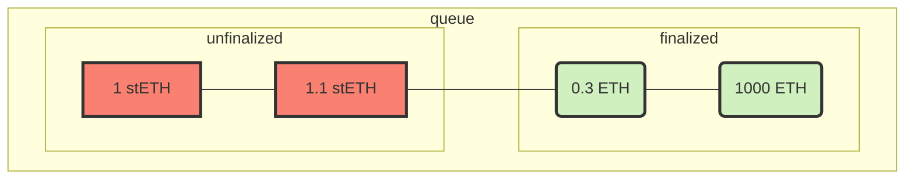

# WithdrawalQueueERC721

- [Código fuente](https://github.com/lidofinance/lido-dao/blob/master/contracts/0.8.9/WithdrawalQueueERC721.sol)
- [Contrato desplegado](https://etherscan.io/address/0x889edC2eDab5f40e902b864aD4d7AdE8E412F9B1)

Una cola FIFO para solicitudes de retiro de `stETH` y una implementación de NFT `unstETH` que representa la posición en la cola.

El acceso a los métodos de palanca está restringido mediante la funcionalidad del contrato [AccessControlEnumerable](https://github.com/lidofinance/lido-dao/blob/master/contracts/0.8.9/utils/access/AccessControlEnumerable.sol)
y una serie de [roles granulares](#roles).

## ¿Qué es WithdrawalQueueERC721?

Este contrato es un punto de entrada principal para intercambiar `stETH` por ether subyacente directamente a través del protocolo Lido.
Es responsable de:

- gestionar una cola de solicitudes de retiro
- comprometer la finalización de la solicitud de retiro como parte del informe del [AccountingOracle](./accounting-oracle.md)
- almacenar `stETH` antes y ether después de la finalización
- transferir ether reservado al usuario al reclamar

Además, el contrato es un NFT `unstETH` [ERC-721](https://eips.ethereum.org/EIPS/eip-721) con extensión de metadatos que representa el derecho a reclamar el ether subyacente una vez que se finalice la solicitud.
Este NFT se acuña al solicitarlo y se quema al reclamarlo. Se utiliza [ERC-4906](https://eips.ethereum.org/EIPS/eip-4906) para actualizar los metadatos tan pronto como cambia el estado de finalización de la solicitud.

## Solicitud

Para solicitar un retiro, se debe aprobar la cantidad de `stETH` o `wstETH` a este contrato o firmar el [Permiso ERC-2612](https://eips.ethereum.org/EIPS/eip-2612) y luego llamar al método `requestWithdrawals*` apropiado.

La **cantidad mínima** para una solicitud es de `100 wei`, y la **máxima** es de `1000 eth`. Cantidades mayores deben dividirse en varias solicitudes, lo que nos permite evitar congestionar la cola con una solicitud demasiado grande.

Durante esta llamada, la solicitud se coloca en la cola y se acuña el NFT `unstETH` relacionado. La siguiente estructura representa la solicitud:

```sol
struct WithdrawalRequestStatus {
    uint256 amountOfStETH;
    uint256 amountOfShares;
    address owner;
    uint256 timestamp;
    bool isFinalized;
    bool isClaimed;
}
```

donde

- **`amountOfStETH`** — la cantidad de tokens `stETH` transferidos al contrato al solicitar
- **`amountOfShares`** — la cantidad de participaciones subyacentes correspondientes a los tokens `stETH` transferidos.
  Consulta el [capítulo de rebalanceo de Lido](lido.md#rebase) para aprender sobre la mecánica de las participaciones
- **`owner`** — la dirección del propietario de esta solicitud. El propietario también es titular del NFT `unstETH`
  y puede transferir la propiedad y reclamar el ether subyacente una vez finalizado
- **`timestamp`** — la hora de creación de la solicitud
- **`isFinalized`** — estado de finalización de la solicitud; las solicitudes finalizadas están disponibles para reclamar
- **`isClaimed`** — estado de reclamación de la solicitud. Una vez reclamada, el NFT se quema y la solicitud no está disponible para reclamar nuevamente

:::note

La cantidad de ether que se retirará está limitada por el número de tokens `stETH` transferidos a este contrato en el momento de la solicitud. Por lo tanto, el usuario no recibirá las recompensas por el período de tiempo en que sus tokens permanezcan en la cola.

:::

## Finalización

Después de presentar una solicitud de retiro, solo se puede reclamar una vez que se produzca la finalización.
El informe del [Accounting Oracle](accounting-oracle.md) finaliza un lote de solicitudes de retiro,
eligiendo el `_maxShareRate` y el tamaño del lote teniendo en cuenta los siguientes factores:

- Si hay suficiente ether para cumplir con la solicitud. El ether puede obtenerse del buffer de Lido, que se llena con la participación de nuevos usuarios, retiros parciales y totales de la cadena Beacon, propinas del protocolo y recompensas MEV.
  Los retiros tienen prioridad sobre los depósitos, por lo que el ether no puede depositarse en la cadena Beacon si algunas solicitudes de retiro pueden ser cumplidas.
- Si ha pasado suficiente tiempo desde que se colocó la solicitud de retiro en la cola (bloqueo de tiempo)
- Si ha habido alguna pérdida masiva para el protocolo en el lado de la cadena Beacon desde que se presentó la solicitud de retiro.
  Esto puede llevar a la finalización a una tasa inferior a 1:1 si la pérdida es lo suficientemente alta como para no ser cubierta con las recompensas diarias (nunca ha sucedido antes)

:::note

En resumen, los titulares de tokens no reciben recompensas pero aún así asumen riesgos durante el retiro. Las recompensas adquiridas
desde que el `stETH` se bloqueó en el WithdrawalQueue se queman al finalizar, distribuyéndolas efectivamente entre los otros titulares de tokens.

:::

Entonces, la finalización establece el valor final de la solicitud, bloquea el ether en el balance de este contrato, quema el `stETH` subyacente y la cola puede verse así en un momento arbitrario:



## Reclamo

Cuando la solicitud está finalizada, puede ser reclamada por el propietario actual, transfiriendo la cantidad reservada de ether a
la dirección del destinatario y quemando el NFT de retiro.

Para ver si la solicitud es reclamable, se puede obtener su estado usando `getWithdrawalStatus()` o suscribirse al evento `WithdrawalsFinalized(uint256 from, uint256 to, ...)`, que se emite una vez que el lote de solicitudes
con ids en el rango `(from, to]` es finalizado.

## Estándares

El contrato implementa los siguientes estándares de Ethereum:

- [ERC-721: Estándar de Token No Fungible](https://eips.ethereum.org/EIPS/eip-721)
- [ERC-165: Detección de Interfaz Estándar](https://eips.ethereum.org/EIPS/eip-165)
- [ERC-4906: Extensión de Actualización de Metadatos de EIP-721](https://eips.ethereum.org/EIPS/eip-4906)

## Métodos relacionados con `ERC-721`

### name()

Devuelve el nombre de la colección de tokens.

```sol
function name() view returns (string memory)
```

### symbol()

Devuelve el símbolo de la colección de tokens.

```sol
function symbol() view returns (string memory)
```

### tokenURI()

Devuelve el Identificador de Recurso Uniforme (URI) para el token `_requestId`. Devuelve una cadena vacía si no se ha establecido un URI base ni una dirección `NFTDescriptor`.

```sol
function tokenURI(uint256 _requestId) view returns (string memory)
```

### balanceOf()

Devuelve el número de tokens en la cuenta de `_owner`.

```sol
function balanceOf(address _owner) view returns (uint256 balance)
```

:::note

Revierte si `_owner` es una dirección cero

:::

### ownerOf()

Devuelve el propietario del token `_requestId`.

```sol
function ownerOf(uint256 _requestId) view returns (address owner)
```

:::note

Requisitos: - La solicitud `_requestId` debe existir. - La solicitud `_requestId` no debe estar reclamada.

:::

### approve()

Da permiso a `_to` para transferir el token `_requestId` a otra cuenta. La aprobación se elimina cuando el token se transfiere.

Emite un evento `Approval`.

```sol
function approve(address _to, uint256 _requestId)
```

:::note

Requisitos: - El llamante debe poseer el token o ser un operador aprobado. - `_requestId` debe existir. - `_to` no debe ser el propietario.

:::

### getApproved()

Devuelve la cuenta aprobada para el token `_requestId`.

```sol
function getApproved(uint256 _requestId) view returns (address)
```

:::note

Revierte si no existe `_requestId`.

:::

### setApprovalForAll()

Aprueba o elimina a `_operator` como operador para el llamante. Los operadores pueden llamar a `transferFrom` o `safeTransferFrom` para cualquier token propiedad del llamante.

Emite un evento `ApprovalForAll`.

```sol
function setApprovalForAll(address _operator, bool _approved)
```

:::note

Revierte si `msg.sender` es igual a `_operator`.

:::

### isApprovedForAll()

Devuelve `true` si el `_operator` está autorizado para gestionar todos los activos de `_owner`.

```sol
function isApprovedForAll(address _owner, address _operator) view returns (bool)
```

### safeTransferFrom()

Transfiere de forma segura el token `_requestId` de `_from` a `_to`, verificando primero que los destinatarios del contrato sean conscientes del
protocolo ERC721 para evitar que los tokens queden bloqueados para siempre.
Si se utiliza una versión con el parámetro `_data`, se pasa a `IERC721Receiver.onERC721Received()` del contrato inteligente de destino como argumento.

Emite un evento `Transfer`.

```sol
function safeTransferFrom(address _from, address _to, uint256 _requestId)
function safeTransferFrom(address _from, address _to, uint256 _requestId, bytes memory _data)
```

:::note

Requisitos:

- `_from` no puede ser la dirección cero.
- `_to` no puede ser la dirección cero.
- El token `_requestId` debe existir y ser propiedad de `_from`.
- Si el llamante no es `_from`, debe tener permiso para mover este token mediante `approve()` o `setApprovalForAll()`.
- Si `_to` se refiere a un contrato inteligente, debe implementar la interfaz `IERC721Receiver`.

:::

### transferFrom()

Transfiere el token `_requestId` de `_from` a `_to`.

Emite un evento `Transfer`.

**ADVERTENCIA**: El uso de este método no es recomendable, use `safeTransferFrom()` siempre que sea posible.

```sol
function transferFrom(address _from, address _to, uint256 _requestId)
```

:::note
Requisitos:

- `_from` no puede ser la dirección cero.
- `_to` no puede ser la dirección cero.
- El token `_requestId` debe ser propiedad de `_from`.
- Si el llamante no es `_from`, debe tener aprobación para mover este token mediante `approve()` o `setApprovalForAll()`.
  :::

### getBaseUri()

Devuelve el URI base para calcular el URI del token. Si está establecido, el URI resultante para cada token será la concatenación del URI base y el `_requestId`.

```sol
function getBaseURI() view returns (string memory)
```

### getNFTDescriptorAddress()

Devuelve la dirección del contrato `NFTDescriptor` responsable de la generación del URI del token.

```sol
function getNFTDescriptorAddress() view returns (address)
```

## Métodos relacionados con `ERC-165`

### supportsInterface()

Devuelve `true` si este contrato implementa la interfaz definida por `interfaceId`. Consulte el [ERC-165](https://eips.ethereum.org/EIPS/eip-165#how-interfaces-are-identified) para obtener más información sobre
cómo se crean estos ids.

```sol
function supportsInterface(bytes4 interfaceId) view returns (bool)
```

:::note

Este contrato devuelve `true` para `IERC721`, `IERC721Metadata`, `IERC4906`, `IAccessControlEnumerable`, `IAccessControl` y `IERC165` en sí mismo.

:::

## Métodos relacionados con la cola

### requestWithdrawals()

Solicita en lote las cantidades `_amounts` de `stETH` para retiro a la dirección `_owner`. Para cada solicitud, la cantidad respectiva de `stETH` se transfiere a esta dirección del contrato, y se acuña un NFT `unstETH` a la dirección `_owner`.

```sol
function requestWithdrawals(uint256[] _amounts, address _owner) returns (uint256[] requestIds)
```

Devuelve la matriz de ids para cada solicitud creada. Emite eventos `WithdrawalRequested` y `Transfer`.

:::note

Requisitos:

- Los retiros no deben estar pausados.
- El saldo de `stETH` de `msg.sender` debe ser mayor o igual a la suma de todos los `_amounts`.
- Debe haber aprobación de `msg.sender` a esta dirección del contrato para la transferencia total de tokens `stETH`.
- Cada cantidad en `_amounts` debe ser mayor o igual a `MIN_STETH_WITHDRAWAL_AMOUNT` y menor o igual a `MAX_STETH_WITHDRAWAL_AMOUNT`.

:::

### requestWithdrawalsWstETH()

Solicita en lote las cantidades `_amounts` de `wstETH` para retiro a la dirección `_owner`. Para cada solicitud, la cantidad respectiva de `wstETH` se transfiere a esta dirección del contrato, se convierte en `stETH`, y se acuña un NFT `unstETH` a la dirección `_owner`.

```sol
function requestWithdrawalsWstETH(uint256[] _amounts, address _owner) returns (uint256[] requestIds)
```

Devuelve la matriz de ids para cada solicitud creada. Emite eventos `WithdrawalRequested` y `Transfer`.

:::note

Requisitos:

- Los retiros no deben estar pausados.
- El saldo de `wstETH` de `msg.sender` debe ser mayor o igual a la suma de todos los `_amounts`.
- Debe haber aprobación de `msg.sender` a esta dirección del contrato para la transferencia total de tokens `wstETH`.
- Cada cantidad en `_amounts` debe tener `getPooledEthByShares(amount)` siendo mayor que `MIN_STETH_WITHDRAWAL_AMOUNT`
  y menor que `MAX_STETH_WITHDRAWAL_AMOUNT`.

:::

### requestWithdrawalsWithPermit()

Solicita en lote las cantidades `_amounts` de `stETH` para retiro a la dirección `_owner`. Para cada solicitud,
la cantidad respectiva de `stETH` se transfiere a esta dirección del contrato,
y se acuña un NFT `unstETH` a la dirección `_owner`. Se utiliza el permiso de `ERC-2612` para aprobar la transferencia de tokens.

```sol
function requestWithdrawalsWithPermit(
    uint256[] _amounts,
    address _owner,
    PermitInput _permit
) returns (uint256[] requestIds)
```

donde `_permit` es la estructura de permiso firmada [ERC-2612](https://eips.ethereum.org/EIPS/eip-2612) definida como:

```sol
struct PermitInput {
    uint256 value;
    uint256 deadline;
    uint8 v;
    bytes32 r;
    bytes32 s;
}
```

Devuelve la matriz de ids para cada solicitud creada. Emite eventos `WithdrawalRequested` y `Transfer`.

:::note

Requisitos:

- Los retiros no deben estar pausados.
- El saldo de `stETH` de `msg.sender` debe ser mayor o igual a la suma de todos los `_amounts`.
- El permiso debe tener una firma válida, un `value` mayor que la suma de todos los `_amounts` y que no haya expirado el `deadline`.
- Cada cantidad en `_amounts` debe ser mayor o igual a `MIN_STETH_WITHDRAWAL_AMOUNT` y menor o igual a `MAX_STETH_WITHDRAWAL_AMOUNT`.

:::

### requestWithdrawalsWstETHWithPermit()

Solicita en lote las cantidades `_amounts` de `wstETH` para retiro a la dirección `_owner`. Para cada solicitud, la cantidad respectiva de `wstETH` se transfiere a esta dirección del contrato, se convierte en `stETH`, y se acuña un NFT `unstETH` a la dirección `_owner`. Se utiliza el permiso de `ERC-2612` para aprobar la transferencia de tokens.

```sol
function requestWithdrawalsWstETHWithPermit(
  uint256[] _amounts,
  address _owner,
  PermitInput _permit
) returns (uint256[] requestIds)
```

donde `_permit` es la estructura de permiso firmada [ERC-2612](https://eips.ethereum.org/EIPS/eip-2612) definida como:

```sol
struct PermitInput {
    uint256 value;
    uint256 deadline;
    uint8 v;
    bytes32 r;
    bytes32 s;
}
```

Devuelve la matriz de ids para cada solicitud creada. Emite eventos `WithdrawalRequested` y `Transfer`.

:::note

Requisitos:

- Los retiros no deben estar pausados.
- El saldo de `wstETH` de `msg.sender` debe ser mayor o igual a la suma de todos los `_amounts`.
- El permiso debe tener una firma válida, un `value` mayor que la suma de todos los `_amounts` y que no haya expirado el `deadline`.
- Cada cantidad en `_amounts` debe tener `getPooledEthByShares(amount)` siendo mayor que `MIN_STETH_WITHDRAWAL_AMOUNT`
  y menor que `MAX_STETH_WITHDRAWAL_AMOUNT`.

:::

### getWithdrawalRequests()

Devuelve todas las solicitudes de retiro que pertenecen a la dirección `_owner`.

```sol
function getWithdrawalRequests(address _owner) view returns (uint256[] requestsIds)
```

:::warning

Esta operación copiará todo el almacenamiento en la memoria, lo que puede ser bastante costoso. Este método está diseñado para ser usado principalmente por los accesores de vista que se consultan sin tarifas de gas. Los desarrolladores deben tener en cuenta que esta función tiene un costo ilimitado, y usarla como parte de una función que cambia el estado puede hacer que la función no se pueda llamar si el conjunto crece hasta el punto en que copiarlo a la memoria consume demasiado gas para caber en un bloque.

:::

### getWithdrawalStatus()

Devuelve `statuses` para las solicitudes con ids en `_requestIds`.

```sol
function getWithdrawalStatus(uint256[] _requestIds)
    view
    returns (WithdrawalRequestStatus[] statuses)
```

Devuelve una matriz de estructuras `WithdrawalRequestStatus`, definidas como:

```sol
struct WithdrawalRequestStatus {
    uint256 amountOfStETH;
    uint256 amountOfShares;
    address owner;
    uint256 timestamp;
    bool isFinalized;
    bool isClaimed;
}
```

donde

- **`amountOfStETH`** — el número de tokens `stETH` transferidos al contrato al momento de la solicitud.
- **`amountOfShares`** — el número de acciones subyacentes correspondientes a los tokens `stETH` transferidos. Consulte el [capítulo de rebalanceo de Lido](lido.md#rebase) para obtener información sobre la mecánica de las acciones.
- **`owner`** — la dirección del propietario de esta solicitud. El propietario también es titular del NFT `unstETH` y puede transferir la propiedad y reclamar el ether subyacente una vez finalizado.
- **`timestamp`** — la hora de creación de la solicitud.
- **`isFinalized`** — estado de finalización de la solicitud; las solicitudes finalizadas están disponibles para ser reclamadas.
- **`isClaimed`** — estado de reclamación de la solicitud. Una vez reclamado, el NFT se quema y la solicitud no está disponible para ser reclamada nuevamente.

### getClaimableEther()

Devuelve las cantidades de ether disponibles para reclamar para cada id de solicitud proporcionado.

```sol
function getClaimableEther(uint256[] _requestIds, uint256[] _hints)
    view
    returns (uint256[] claimableEthValues)
```

donde

- **`_requestIds`** — la matriz de ids de solicitud para verificar el ether reclamable.
- **`_hints`** — pista de punto de control para cada id de solicitud. Se puede obtener llamando a [`findCheckpointHints()`](#findcheckpointhints).

Devuelve la matriz de cantidades de ether disponibles para reclamar para cada id de solicitud. La cantidad es igual a 0 si la solicitud no está finalizada o ya ha sido reclamada.

### claimWithdrawalsTo()

Reclama un lote de solicitudes de retiro si están finalizadas, enviando ether a la dirección `_recipient`.

```sol
function claimWithdrawalsTo(uint256[] _requestIds, uint256[] _hints, address _recipient)
```

donde

- **`_requestIds`** — la matriz de ids de solicitud para verificar el ether reclamable.
- **`_hints`** — pista de punto de control para cada id de solicitud. Se puede obtener llamando a [`findCheckpointHints()`](#findcheckpointhints).
- **`_recipient`** — la dirección del destinatario para el ether reclamado.

Emite un lote de eventos `Transfer` a la dirección cero y eventos `WithdrawalClaimed`.

:::note

Requisitos:

- Todos los `_requestIds` deben existir, estar finalizados y no reclamados.
- Todas las `_hints` deben ser válidas para las solicitudes respectivas.
- `msg.sender` debe ser el propietario de todas las solicitudes.
- `_recipient` no debe ser cero.

:::

### claimWithdrawals()

Reclama un lote de solicitudes de retiro si están finalizadas, enviando ether a la dirección `msg.sender`.

```sol
function claimWithdrawals(uint256[] _requestIds, uint256[] _hints)
```

donde

- **`_requestIds`** — la matriz de ids de solicitud para verificar el ether reclamable.
- **`_hints`** — pista de punto de control para cada id de solicitud. Se puede obtener llamando a [`findCheckpointHints()`](#findcheckpointhints).

Emite un lote de eventos `Transfer` a la dirección cero y eventos `WithdrawalClaimed`.

:::note

Requisitos:

- Todos los `_requestIds` deben existir, estar finalizados y no reclamados.
- Todas las `_hints` deben ser válidas para las solicitudes respectivas.
- `msg.sender` debe ser el propietario de todas las solicitudes.

:::

### claimWithdrawal()

Reclama la solicitud de retiro `_requestId`, enviando ether a la dirección `msg.sender`.

```sol
function claimWithdrawal(uint256 _requestId)
```

Emite un evento `Transfer` a la dirección cero y un evento `WithdrawalClaimed`.

:::note

Requisitos:

- `msg.sender` debe ser el propietario de la solicitud `_requestId`.
- La solicitud `_requestId` debe existir, estar finalizada y no reclamada.

:::

### findCheckpointHints()

Devuelve una matriz de pistas para los `_requestIds` dados, buscando entre los puntos de control con índices en el rango `[_firstIndex, _lastIndex]`.

```sol
function findCheckpointHints(uint256[] _requestIds, uint256 _firstIndex, uint256 _lastIndex)
    view
    returns (uint256[] hintIds)
```

:::note

Requisitos:

- La matriz de ids de solicitud debe estar ordenada.
- `_firstIndex` debe ser mayor que 0, porque la lista de puntos de control es una matriz basada en 1.
- `_lastIndex` debe ser menor o igual a [`getLastCheckpointIndex()`](#getlastcheckpointindex).

:::

### isBunkerModeActive()

Devuelve `true` si el modo bunker está activo.

```sol
function isBunkerModeActive() view returns (bool)
```

### bunkerModeSinceTimestamp()

Devuelve la marca de tiempo de la última activación del modo bunker, si está activo ahora y `BUNKER_MODE_DISABLED_TIMESTAMP` si el modo bunker está desactivado (es decir, el protocolo está en modo turbo).

```sol
function bunkerModeSinceTimestamp() view returns (uint256)
```

### getLastRequestId()

Devuelve el id de la última solicitud en la cola.

```sol
function getLastRequestId() view returns (uint256)
```

:::note

Las solicitudes se indexan desde `1`, por lo que devuelve `0` si no hay solicitudes en la cola.

:::

### getLastFinalizedRequestId()

Devuelve el id de la última solicitud finalizada en la cola.

```sol
function getLastFinalizedRequestId() view returns (uint256)
```

:::note

Las solicitudes se indexan desde `1`, por lo que devuelve `0` si no hay solicitudes finalizadas en la cola.

:::

### getLockedEtherAmount()

Devuelve la cantidad de ether en el balance bloqueada para retiro y disponible para reclamar.

```sol
function getLockedEtherAmount() view returns (uint256)
```

### getLastCheckpointIndex()

Devuelve la longitud de la matriz de puntos de control. Último valor posible para la pista.

```sol
function getLastCheckpointIndex() view returns (uint256)
```

:::note

Los puntos de control se indexan desde `1`, por lo que devuelve `0` si aún no hay puntos de control.

:::

### unfinalizedRequestNumber()

Devuelve el número de solicitudes no finalizadas en la cola.

```sol
function unfinalizedRequestNumber() view returns (uint256)
```

### unfinalizedStETH()

Devuelve la cantidad de `stETH` en la cola que aún no se ha finalizado.

```sol
function unfinalizedStETH() view returns (uint256)
```

### calculateFinalizationBatches()

Vista para uso fuera de la cadena por el demonio del oráculo que calcula cuántas solicitudes se pueden finalizar dentro del presupuesto dado, período de tiempo y límites de tasa de acciones. Las solicitudes devueltas se dividen en lotes. Todas las solicitudes que pertenecen a un lote deben tener su tasa de participación por encima o por debajo (o igual) al `_maxShareRate`. A continuación, puede ver un ejemplo de cómo 14 solicitudes con diferentes tasas de participación se dividirán en cinco lotes por este método:

```txt
 ^ share rate
 |
 |         • •
 |       •    •   • • •
 |----------------------•------   _maxShareRate
 |   •          •        • • •
 | •
 +-------------------------------> requestId
  | 1 |    2   |3|  4  |   5   |    batch number
```

```sol
function calculateFinalizationBatches(
    uint256 _maxShareRate,
    uint256 _maxTimestamp,
    uint256 _maxRequestsPerCall,
    BatchesCalculationState _state
) external view returns (BatchesCalculationState)
```

donde

- **`_maxShareRate`** — la tasa de participación máxima (ETH por participación) que se utilizará para la finalización (precisión de 1e27)
- **`_maxTimestamp`** — la marca de tiempo máxima de la solicitud que se puede finalizar
- **`_maxRequestsPerCall`** — el número máximo de solicitudes que se puede procesar por iteración
- **`_state`** — el estado actual del cálculo, representado con una estructura `BatchesCalculationState`:

  ```sol
  struct BatchesCalculationState {
      uint256 remainingEthBudget;
      bool finished;
      uint256[MAX_BATCHES_LENGTH] batches;
      uint256 batchesLength;
  }
  ```

  - **`remainingEthBudget`** — la cantidad actual restante de ether. Debe establecerse en todo el presupuesto de
    la finalización en la primera llamada.
  - **`finished`** — la bandera que se establece en `true` si se iteran todas las solicitudes.
  - **`batches`** — la matriz resultante de lotes, cada uno representado por el id de la última solicitud en el lote.
  - **`batchesLength`** — la longitud de la parte llena de la matriz `batches`.

Devuelve el estado actual del cálculo de lotes de finalización.

:::note
Este método está diseñado para uso iterativo bajo límites de gas. Por lo tanto, en el caso de que el número de retiros sea demasiado grande para iterar en una sola llamada, se puede usar este método repetidamente, pasando el valor de retorno como argumento para la próxima llamada mientras devuelva `finished` igual a `false`.
:::

### prefinalize()

Verifica los lotes de finalización y calcula la cantidad de ether necesaria para bloquear y la cantidad de participaciones a quemar.

Diseñado para usar durante el informe del oráculo para encontrar la cantidad de ether que se debe enviar junto con la llamada `finalize()`.

```sol
function prefinalize(uint256[] _batches, uint256 _maxShareRate)
    view
    returns (uint256 ethToLock, uint256 sharesToBurn)
```

donde

- **`_batches`** — lotes de finalización calculados fuera de la cadena utilizando `calculateFinalizationBatches()`.
- **`_maxShareRate`** — tasa de participación máxima (ETH por participación) para la finalización de solicitudes (precisión de 1e27).

Devuelve

- **`ethToLock`** — la cantidad de ether a enviar con el método `finalize()`.
- **`sharesToBurn`** — el número de participaciones a quemar para coincidir con esta llamada de finalización.

## Métodos protegidos

### Roles

- **FINALIZE_ROLE** — rol para finalizar solicitudes de retiro en la cola.
- **PAUSE_ROLE** — rol para pausar el retiro en el protocolo.
- **RESUME_ROLE** — rol para reanudar el retiro después de haber sido pausado.
- **ORACLE_ROLE** — rol para proporcionar los datos relacionados con el oráculo necesarios, como la última marca de tiempo del informe y si el protocolo está en modo bunker.
- **MANAGE_TOKEN_URI_ROLE** — rol para establecer los parámetros para construir el URI del token: el URI base
  o la dirección de `NFTDescriptor`.

### finalize()

Finaliza solicitudes desde la última finalizada hasta `_lastRequestIdToBeFinalized` utilizando `_maxShareRate`
como tasa de participación base para `stETH` y pasando junto con algo de ether como `msg.value`.
La cantidad de ether a enviar debe precalcularse con el método `prefinalize()`.

Emite un evento `BatchMetadataUpdate` y un evento `WithdrawalsFinalized`.

```sol
function finalize(uint256 _lastRequestIdToBeFinalized, uint256 _maxShareRate) payable
```

donde

- **`_lastRequestIdToBeFinalized`** — el último id de solicitud a finalizar.
- **`_maxShareRate`** — la tasa de participación máxima (ETH por participación) para la finalización de solicitudes (precisión de 1e27).

:::note

Requisitos:

- los retiros no deben estar pausados.
- `msg.sender` debe tener asignado el rol `FINALIZE_ROLE`.
- `_lastRequestIdToBeFinalized` debe ser un id de solicitud no finalizada existente.
- `msg.value` debe ser menor o igual a la suma de `stETH` no finalizada hasta `_lastRequestIdToBeFinalized`.

:::

### pauseFor()

Pausa la colocación de solicitudes de retiro y la finalización durante una `_duration` particular. Reclamar solicitudes finalizadas seguirá estando disponible.

Emite un evento `Paused`.

```sol
function pauseFor(uint256 _duration) onlyRole(PAUSE_ROLE)
```

donde

- **`_duration`** — duración de la pausa en segundos (usar `PAUSE_INFINITELY` para ilimitado).

:::note

Requisitos:

- `msg.sender` debe tener asignado el rol `PAUSE_ROLE`.
- `_duration` no debe ser cero.
- el contrato no debe estar ya pausado.

:::

### pauseUntil()

Pausa la colocación de solicitudes de retiro y la finalización hasta la marca de tiempo `_pauseUntilInclusive`.
Reclamar solicitudes finalizadas seguirá estando disponible.

Emite un evento `Paused`.

```sol
function pauseUntil(uint256 _pauseUntilInclusive) onlyRole(PAUSE_ROLE)
```

donde

- **`_pauseUntilInclusive`** — la marca de tiempo `block.timestamp` hasta la cual pausar (inclusive).

:::note

Requisitos:

- `msg.sender` debe tener asignado el rol `PAUSE_ROLE`.
- `_pauseUntilInclusive` no debe estar en el pasado.
- el contrato no debe estar ya pausado.

:::

### resume()

Resumes withdrawal requests placement and finalization.
The contract is deployed in a paused state and should be resumed explicitly.

Emits a `Resumed` event.

```sol
function resume()
```

:::note

Requirements:

- `msg.sender` must have a `RESUME_ROLE` assigned
- the contract must not be already resumed

:::

### onOracleReport()

Updates bunker mode state and last report timestamp.

Emits a `BunkerModeEnabled` or a `BunkerModeDisabled` event.

```sol
function onOracleReport(
    bool _isBunkerModeNow,
    uint256 _bunkerStartTimestamp,
    uint256 _currentReportTimestamp
)
```

where

- **`_isBunkerModeNow`** — is bunker mode reported by the oracle
- **`_bunkerStartTimestamp`** — timestamp of the bunker mode activation
- **`_currentReportTimestamp`** — timestamp of the current report ref slot

:::note

Requirements:

- `msg.sender` must have an `ORACLE_ROLE` assigned
- all timestamps must be in the past

:::

### setBaseUri()

Sets the Base URI for computing token URI.

If the `NFTDescriptor` address isn't set, the `baseURI` would be used for generating the `ERC-721` token URI.
Otherwise, the `NFTDescriptor` address would be used as a first-priority method.

Emits a `BaseURISet` event

```sol
function setBaseURI(string _baseURI) external onlyRole(MANAGE_TOKEN_URI_ROLE)
```

where

- **`_baseURI`** — the base URI to derive the token URI from. Should not end on `/`

:::note

Reverts if `msg.sender` has no `MANAGE_TOKEN_URI_ROLE` assigned.

:::

### setNFTDescriptorAddress()

Sets the address of the `NFTDescriptor` contract responsible for token URI generation.

If the `NFTDescriptor` address isn't set, the `baseURI` would be used for generating the `ERC-721` token URI.
Otherwise, the `NFTDescriptor` address would be used as a first-priority method.

Emits a `NftDescriptorAddressSet` event.

```sol
function setNFTDescriptorAddress(address _nftDescriptorAddress) onlyRole(MANAGE_TOKEN_URI_ROLE)
```

where

- **`_nftDescriptorAddress`** — is the address of `NFTDescriptor` contract,
  which must support the `INFTDescriptor` interface:

```sol
interface INFTDescriptor {
  function constructTokenURI(uint256 _requestId) external view returns (string memory)
}
```

:::note

Reverts if `msg.sender` has no `MANAGE_TOKEN_URI_ROLE` assigned.

:::
