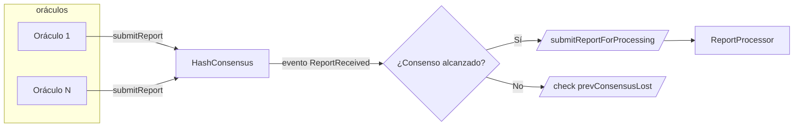
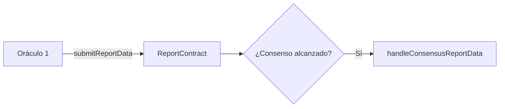
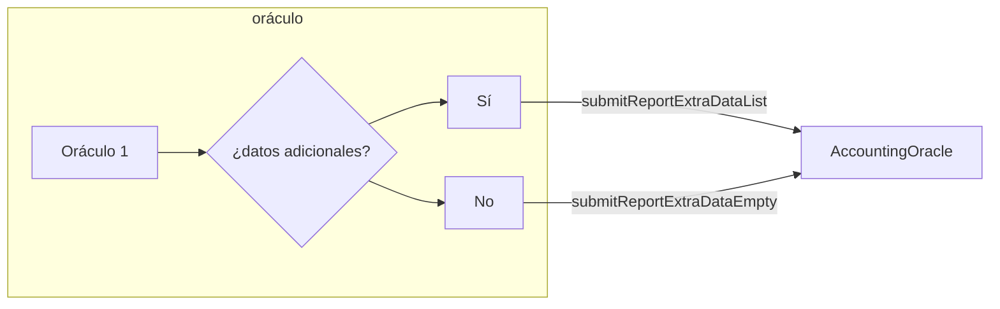

# Manual del Operador del Oracle

Este documento está destinado a aquellos que desean participar en el protocolo Lido como entidad que ejecuta un demonio para sincronizar el estado desde la Capa Beacon hasta la Capa de Ejecución del protocolo. Debido a la falta de comunicación nativa entre estas dos redes, Lido emplea una red de oráculos para sincronizar el sistema en intervalos regulares.

## TL;DR

1. Genera una dirección Ethereum.
2. Inicia y sincroniza un nodo de Capa de Ejecución (archivado durante al menos 2 semanas) con el endpoint JSON-RPC habilitado.
3. Inicia y sincroniza un nodo de Capa de Consenso (archivado) con el endpoint de API habilitado.
4. Inicia el servicio de la API de Keys.
5. Inicia los módulos de contabilidad y ejector del Oracle.
6. **Opcional:** Añade alertas a las métricas de Prometheus del Oracle.
7. En caso de mainnet, comparte tu dirección e intención de unirte al conjunto del Oracle de forma pública. Debes publicarlo en Twitter y también escribir un mensaje con el enlace de Twitter bajo la publicación de Onboarding en [el foro de Investigación](https://research.lido.fi/).
8. Proporciona tu dirección Ethereum del Oracle al equipo de Lido para que vote por agregar tu dirección al conjunto de miembros del Oracle.

## Introducción

El mecanismo Oracle de Lido comprende tres componentes principales. El primer componente es el conjunto de contratos inteligentes de Oracle, que recibe informes de actualización de los oráculos y los transmite al contrato Lido para ejecutar las acciones necesarias basadas en los cambios reportados. El segundo componente es el demonio oráculo fuera de la cadena, ejecutado por cada nodo oráculo y responsable de monitorear el estado del protocolo y generar informes de actualización. El tercer componente es la red de nodos informáticos que ejecutan los miembros del oráculo, que proporcionan colectivamente la información necesaria para que el contrato inteligente Oracle calcule el nuevo estado del protocolo.

Basándose en los informes de actualización recibidos de los oráculos, el contrato inteligente Lido realiza transiciones de estado como actualizar los saldos de los usuarios, procesar solicitudes de retiro y distribuir recompensas a los operadores de nodos. Así, el mecanismo Oracle de Lido actúa como un dispositivo de sincronización que conecta el protocolo a través de las capas de ejecución y consenso. Garantiza que el protocolo se actualice de manera oportuna y precisa, permitiendo el funcionamiento fluido y eficiente de todo el sistema Lido.

Los dos contratos principales en el suite Oracle de Lido se llaman [AccountingOracle](/contracts/accounting-oracle) y [ValidatorsExitBus](/contracts/validators-exit-bus-oracle). Juntos, estos contratos recopilan información presentada por los oráculos sobre el estado de los validadores y sus saldos, la cantidad de fondos acumulados en las bóvedas del protocolo, el número de solicitudes de retiro que el protocolo puede procesar y los validadores que se espera que salgan voluntariamente para finalizar más solicitudes de retiro. Esta información se utiliza luego para procesos cruciales como:

- Rebasar los saldos de los usuarios.
- Distribuir recompensas a los operadores de nodos.
- Procesar solicitudes de retiro.
- Decidir qué validadores deben iniciar la salida voluntaria.
- Distribuir la participación.
- Poner el protocolo en modo búnker.

## Fases del Oracle

Para enviar los datos del informe por parte del operador del oráculo tanto a `AccountingOracle` como a `ValidatorsExitBusOracle`, es necesario que:

- Este operador participe en el comité del oráculo, y
- Se debe alcanzar un consenso para el informe correspondiente.

El proceso de enviar los datos del informe se puede dividir en 3 etapas principales:

### Fase 1. Envío de un hash de informe y alcanzar consenso

En la primera etapa, los operadores del oráculo recopilan un informe para un determinado `refSlot` y envían el hash al contrato `HashConsensus`.

El diagrama siguiente muestra:
`ReportProcessor` - Contrato `AccountingOracle` o `ValidatorsExitBusOracle`.
`HashConsensus` - Un contrato que gestiona el comité de miembros del oráculo y permite a los miembros alcanzar consenso sobre el hash de datos particular para cada marco de informe.

Puedes leer más sobre `HashConsensus` [aquí](/contracts/hash-consensus).



### Fase 2. Envío de datos del informe

Cuando se alcanza el consenso, uno de los operadores del oráculo envía los datos del informe y activa la actualización del estado central del protocolo (incluido el rebase del token, la distribución de recompensas a los operadores de nodos, la finalización de solicitudes de retiro y la decisión de entrar en el modo búnker) o emite eventos `ValidatorExitRequest` para informar a los operadores de nodos sobre las nuevas solicitudes de salida voluntaria necesarias para realizar.



### Fase 3. Envío de datos adicionales del informe

Este paso es necesario para `AccountingOracle`, que implica la distribución de recompensas para módulos de staking en esta fase.



## Membresía del Comité

El conjunto actual de Oracle consta de 9 participantes:

- Chorus One `0x140bd8fbdc884f48da7cb1c09be8a2fadfea776e`
- Staking Facilities `0x404335bce530400a5814375e7ec1fb55faff3ea2`
- stakefish `0x946d3b081ed19173dc83cd974fc69e1e760b7d78`
- P2P Validator `0x007de4a5f7bc37e2f26c0cb2e8a95006ee9b89b5`
- Rated [0xec4bfbaf681eb505b94e4a7849877dc6c600ca3a](https://research.lido.fi/t/expansion-of-lidos-ethereum-oracle-set/2836/49)
- bloXroute [0x61c91ECd902EB56e314bB2D5c5C07785444Ea1c8](https://research.lido.fi/t/expansion-of-lidos-ethereum-oracle-set/2836/54)
- Instadapp [0x1ca0fec59b86f549e1f1184d97cb47794c8af58d](https://research.lido.fi/t/expansion-of-lidos-ethereum-oracle-set/2836/53)
- Kyber Network [0xA7410857ABbf75043d61ea54e07D57A6EB6EF186](https://research.lido.fi/t/expansion-of-lidos-ethereum-oracle-set/2836/52)
- ChainLayer [0xc79F702202E3A6B0B6310B537E786B9ACAA19BAf](https://research.lido.fi/t/expansion-of-lidos-ethereum-oracle-set/2836/69)

El quórum es 5/9. Esto significa que la finalización del informe solo puede ocurrir cuando hay 5 informes idénticos de 5 miembros de oráculos diferentes.

Consulta [Expansion of Lido on Ethereum Oracle set](https://research.lido.fi/t/expansion-of-lidos-ethereum-oracle-set/2836) para más detalles.

## Requisitos Previos

### Nodo Cliente de Ejecución

Para preparar el informe, el Oracle recupera hasta 10 días de eventos antigu

os, realiza solicitudes históricas de datos de saldo y genera informes simulados en bloques históricos. Esto requiere un nodo de ejecución archivado con al menos dos semanas de datos archivados.

| Cliente                                          | Probado | Notas                                                                                                                                                                                 |
|--------------------------------------------------|---------|---------------------------------------------------------------------------------------------------------------------------------------------------------------------------------------|
| [Geth](https://geth.ethereum.org/)               |         | `--gcmode=archive` <br/> `--syncmode=snap` <br/><br/>O<br/><br/>`--gcmode=archive`<br/>`--syncmode=full`                                                                              |
| [Nethermind](https://nethermind.io/)             |         | No probado aún                                                                                                                                                                         |
| [Besu](https://besu.hyperledger.org/en/stable/)  |         | Usar <br/> `--rpc-max-logs-range=100000` <br/> `--sync-mode=FULL` <br/> `--data-storage-format="FOREST"` <br/> `--pruning-enabled` <br/>`--pruning-blocks-retained=100000` <br/> parámetros |
| [Erigon](https://github.com/ledgerwatch/erigon)  |         | Usar <br/> `--prune=htc` <br/> `--prune.h.before=100000` <br/> `--prune.t.before=100000` <br/> `--prune.c.before=100000` <br/> parámetros                                                 |

### Nodo Cliente de Consenso

Para calcular algunas métricas para el modo búnker, Oracle necesita un nodo de consenso archivado.

| Cliente                                            | Probado | Notas                                                                                                                                               |
|----------------------------------------------------|---------|-----------------------------------------------------------------------------------------------------------------------------------------------------|
| [Lighthouse](https://lighthouse.sigmaprime.io/)    |         | Usar el parámetro `--reconstruct-historic-states`.                                                                                                           |
| [Lodestar](https://nethermind.io/)                 |         | No probado aún                                                                                                                                      |
| [Nimbus](https://nimbus.guide/quick-start.html)    |         | No probado aún                                                                                                                                      |
| [Prysm](https://github.com/ledgerwatch/erigon)     |         | Usar <br/> `--grpc-max-msg-size=104857600` <br/> `--enable-historical-state-representation=true` <br/> `--slots-per-archive-point=1024` <br/> parámetros |
| [Teku](https://docs.teku.consensys.net)            |         | Usar <br/> `--data-storage-mode=archive` <br/>`--data-storage-archive-frequency=1024`<br/> `--reconstruct-historic-states=true`<br/> parámetros          |

### Servicio de API de Keys

Este es un servicio separado que utiliza el cliente de ejecución para recuperar todas las claves de Lido. Almacena el estado más reciente de las claves de Lido en la base de datos.

[Repositorio de Lido Keys API](https://github.com/lidofinance/lido-keys-api)

## El daemon del Oracle

El daemon Oracle es una aplicación en Python que contiene dos módulos:

- Módulo de contabilidad
- Módulo ejector

El código fuente del Oracle está disponible en [https://github.com/lidofinance/lido-oracle](https://github.com/lidofinance/lido-oracle).

Los módulos obtienen el slot reportable, y si este slot está finalizado, calculan y envían el informe a los contratos inteligentes AccountingOracle y ExitBusOracle.

### Variables de entorno

El daemon Oracle requiere las siguientes variables de entorno:

**Requeridas**

- `EXECUTION_CLIENT_URI` - lista de URI del cliente de ejecución separados por coma. El segundo y siguientes URI se usarán como respaldo.
- `CONSENSUS_CLIENT_URI` - lista de URI del cliente de consenso separados por coma. El segundo y siguientes URI se usarán como respaldo.
- `KEYS_API_URI` - lista de URI del cliente de API de Keys separados por coma. El segundo y siguientes URI se usarán como respaldo.
- `LIDO_LOCATOR_ADDRESS` - dirección del contrato inteligente Lido Locator.

**Opcional**

**Uno de:**

- `MEMBER_PRIV_KEY` - Clave privada de la cuenta de miembro del Oracle.
- `MEMBER_PRIV_KEY_FILE` - Ruta al archivo que contiene la clave privada de la cuenta de miembro del Oracle.

Se puede encontrar una lista completa [aquí](https://github.com/lidofinance/lido-oracle#env-variables).

### Dirección del Lido Locator

**Mainnet**
**[0xC1d0b3DE6792Bf6b4b37EccdcC24e45978Cfd2Eb](https://etherscan.io/address/0xC1d0b3DE6792Bf6b4b37EccdcC24e45978Cfd2Eb)**

**Holešky**
**[0x28FAB2059C713A7F9D8c86Db49f9bb0e96Af1ef8](https://holesky.etherscan.io/address/0x28FAB2059C713A7F9D8c86Db49f9bb0e96Af1ef8)**

### Ejecución del daemon

Iniciar el módulo de contabilidad

```shell
docker run -d --name lido-oracle-accounting \
  --env "EXECUTION_CLIENT_URI=$EXECUTION_CLIENT_URI" \
  --env "CONSENSUS_CLIENT_URI=$CONSENSUS_CLIENT_URI" \
  --env "KEYS_API_URI=$KEYS_API_URI" \
  --env "LIDO_LOCATOR_ADDRESS=$LOCATOR_ADDRESS" \
  --env "MEMBER_PRIV_KEY=$MEMBER_PRIV_KEY" \
  lidofinance/oracle@<hash de la imagen> accounting
```

Iniciar el módulo ejector

```shell
docker run -d --name lido-oracle-ejector \
  --env "EXECUTION_CLIENT_URI=$EXECUTION_CLIENT_URI" \
  --env "CONSENSUS_CLIENT_URI=$CONSENSUS_CLIENT_URI" \
  --env "KEYS_API_URI=$KEYS_API_URI" \
  --env "LIDO_LOCATOR_ADDRESS=$LOCATOR_ADDRESS" \
  --env "MEMBER_PRIV_KEY=$MEMBER_PRIV_KEY" \
  lidofinance/oracle@<hash de la imagen> ejector
```

**Hash de la imagen más reciente**
[https://docs.lido.fi/guides/tooling/#oracle](https://docs.lido.fi/guides/tooling/#oracle)

Esto iniciará el Oracle en modo daemon. También puedes ejecutarlo en modo puntual, por ejemplo, si prefieres activar la ejecución del Oracle como un trabajo `cron`. En este caso, establece la variable de entorno `DAEMON` en 0.

### Métricas y Alertas

Cómo configurar alertas y detalles sobre métricas se pueden encontrar [aquí](https://github.com/lidofinance/lido-oracle#alerts).
