# Guía de puenteo para wstETH en rollups

:::warning Descargo de responsabilidad
Esta guía proporciona recomendaciones proporcionadas por el grupo de trabajo NEW. NEW no representa a la DAO de Lido y al proporcionar la retroalimentación, no ofrece garantías expresas o implícitas, y renuncia a todas las garantías implícitas, incluida cualquier garantía sobre la probabilidad de reconocimiento o rechazo por parte de la DAO de Lido y representación.
:::

## Introducción

Este documento está dirigido a desarrolladores que representan fundaciones de redes/rollups y DAOs que buscan llevar el token wstETH de Lido a redes Ethereum L2 (rollup).

:::info
Esta guía no cubre aún el puenteo del token stETH rebaseable ni el puenteo hacia redes que no sean L2-rollup. Sin embargo, es importante tener en cuenta que el puenteo de un token stETH rebaseable de manera convencional puede resultar en la pérdida de activos de los usuarios debido a que las recompensas acumuladas quedan atrapadas en un puente L1.
:::

Aunque técnicamente es factible puentear el token wstETH en una red L2 como cualquier otro token ERC-20 estándar y compatible, podría no estar alineado con la visión a largo plazo de la DAO de Lido para la adopción futura de stETH y el sentimiento general de la comunidad.

Esta guía cubre las recomendaciones y proporciona directrices generales, además de explicar la lógica detrás del proceso para facilitar el proceso. **Es fundamental entender que cumplir o divergir de estas directrices no asegura el reconocimiento o rechazo de una propuesta específica por parte de la DAO de Lido.** No obstante, adherirse a estas directrices aumenta sustancialmente la probabilidad de obtener apoyo del Grupo de Trabajo de Expansión de Red (NEW) y la comunidad. Finalmente, la decisión final se determina mediante el proceso de votación.

:::info
Por favor, envía cualquier retroalimentación sobre la guía al grupo NEW; el documento se actualiza de manera iterativa.
:::

## ¿Por qué se necesita esta guía?

Como se mencionó anteriormente, la forma estándar de puentear un token ERC-20 es desplegar un token no actualizable en L2 y utilizar el contrato de puente general. Sin embargo, esta guía propone implementar una solución más compleja.

La solución implica desplegar contratos de punto final de puente dedicados detrás de un proxy en L1 y L2, y un token actualizable en L2, todos gobernados por la DAO de Lido en L1 en el contract ([Aragon Agent](https://etherscan.io/address/0x3e40D73EB977Dc6a537aF587D48316feE66E9C8c)) a través de un contrato de [governance executor](https://github.com/lidofinance/governance-crosschain-bridges/) dedicado en L2. Esta arquitectura se propone para proporcionar las siguientes capacidades:

1. Pasar datos arbitrarios. Esto permite sentar las bases para el puenteo futuro del token stETH rebaseable (necesidad de pasar la tasa wstETH/stETH).
2. Reestructurar la lógica del token, ya que stETH no es un token de propósito general sino un activo construido sobre un middleware de staking líquido.
3. Asegurar el token para el futuro, por ejemplo, evitando la migración costosa de liquidez a medida que Ethereum continúa evolucionando y se adoptan nuevos estándares como [ERC-2612](https://eips.ethereum.org/EIPS/eip-2612)/[ERC-1271](https://eips.ethereum.org/EIPS/eip-1271).
4. Pausar y reanudar el puenteo en caso de emergencia o durante actualizaciones.

# Reconocimiento de los endpoints de puenteo de wstETH de la DAO de Lido

La DAO de Lido puede reconocer los puntos de puenteo de wstETH mediante una instantánea de señalización. Por ejemplo, esto ha ocurrido con:

- [Base](https://snapshot.org/#/lido-snapshot.eth/proposal/0x8b35f64fffe67f67d4aeb2de2f3351404c54cd75a08277c035fa77065b6792f4)
- [zkSync Era](https://snapshot.org/#/lido-snapshot.eth/proposal/0xe35f56a6117599eeb9dbef982613c0545710d91403a828d1fba00ab21d5188f3)
- [Mantle](https://snapshot.org/#/lido-snapshot.eth/proposal/0x1d38c11b27590ab5c69ca21c5d2545d53b7f5150dada7e05f89d500ede5becad)
- [Linea](https://snapshot.org/#/lido-snapshot.eth/proposal/0x9382624eeee68a175dd7d1438347dbad4899ba0d2bfcf7c3955f087cb9f5cfc4)
- [Scroll](https://snapshot.org/#/lido-snapshot.eth/proposal/0xcdb7d84ea80d914a4abffd689ecf9bdc4bb05d47f1fdbdda8793d555381a0493)

Si la DAO de Lido reconoce los endpoints de puenteo de wstETH, generalmente significa:

- La integración se destaca en las páginas frontend: [página de inicio](https://lido.fi/lido-on-l2), [widget](https://stake.lido.fi/) y [páginas del ecosistema](https://lido.fi/lido-ecosystem).
- Cuando/se implementa la interfaz de usuario de puenteo dedicada de Lido, se incluirá la red.
- Se publica un anuncio de integración recién aparecido en el [blog](https://blog.lido.fi/category/l2/) y [Twitter](https://twitter.com/LidoFinance) de Lido.
- Los contratos de punto final están bajo el programa de recompensas por errores de seguridad de Lido [bug bounty program](https://immunefi.com/bug-bounty/lido/).
- Los contratos de punto final son monitoreados mediante el sistema de alertas de Lido [Lido alerting system](https://github.com/lidofinance/alerting-forta/).
- Se abre la oportunidad para obtener soporte adicional, potencialmente de [LEGO](https://lido.fi/lego) o [Liquidity observation Labs](https://lido.fi/governance#liquidity-observation-labs). Para más detalles, se debe [contactar a ProRel](https://tally.so/r/waeRLX).

Por lo general, la DAO de Lido reconoce los puntos de puenteo de wstETH si se siguen un conjunto específico de recomendaciones de seguridad y diseño. Estas recomendaciones se detallan en la sección [Recomendaciones](#recomendaciones) en los párrafos **R-1..R-8**. El cumplimiento de las recomendaciones **R-9...** también es importante y fomenta la probabilidad de reconocimiento.

Si se siguen las recomendaciones **R-1...R-4**, el token puede tener la posibilidad de ser reconocido por NEW como cumpliendo con las bases de seguridad y futurización.

Si no se sigue alguna de las recomendaciones **R-1...R-4**, puede haber menos probabilidad de reconocimiento por parte de la DAO de Lido o de reconocimiento por NEW.

## Escenario general hacia el reconocimiento de la DAO de Lido

Esta sección describe un camino aproximado para puenteo de wstETH a una red L2. El orden de los pasos no es estricto pero sigue el flujo general.

🐾 Estudiar la guía de puenteo y completar [el cuestionario](#cuestionario) sobre tu solución y enviarlo a NEW.

🐾 Coordinar sobre la prioridad, tiempos y revisiones con NEW.

🐾 Verificar la arquitectura y la configuración de despliegue por NEW.

🐾 Desplegar los contratos en testnet. Obtener la verificación del despliegue en testnet coordinando con NEW.

🐾 Expresar la intención de puentear wstETH en el foro, detallando los detalles y plan técnico. Considerar:

- Apuntar a una red por propuesta para enfocar la discusión.
- El post debe ser publicado con anticipación, idealmente al menos dos semanas antes de cualquier voto de instantánea potencial, para permitir tiempo para la discusión y verificación de la propuesta.
- Las direcciones de despliegue no son necesarias de inmediato pero deben ser propuestas al menos una semana antes de que comience la votación de instantánea.
- Si la solución propuesta no incluye algunas de las recomendaciones (**R-5...**), considera incluir el roadmap y comprometerte a entregarlo.
- Ejemplos:
  - [wstETH a Base](https://research.lido.fi/t/wsteth-deployment-to-base-and-ownership-acceptance-by-lido-dao/5668)
  - [wstETH a zkSync Era](https://research.lido.fi/t/wsteth-deployment-on-zksync/5701)
  - [wstETH a Mantle](https://research.lido.fi/t/wsteth-deployment-on-mantle/5991)
  - [wstETH a Linea](https://research.lido.fi/t/wsteth-on-linea-ownership-acceptance-by-lido-dao/5961)
  - [wstETH a Scroll](https://research.lido.fi/t/wsteth-deployment-on-scroll/6603)
  - [wstETH a Mode](https://research.lido.fi/t/wsteth-deployment-on-mode/7365)

🐾 Desplegar los contratos en mainnet. Obtener la verificación del despliegue en mainnet por parte de un grupo de seguridad externo (contactando con NEW).

🐾 Pasar la votación de snapshot en https://snapshot.org/#/lido-snapshot.eth/. Debe contener las direcciones finales de mainnet y auditorías según **R-1**. De lo contrario, se requeriría una votación adicional de snapshot con las direcciones.

Aquí también hay un árbol de decisiones aproximado para guiar este escenario.

```mermaid
graph TD;
  A("¿Está wstETH ya puentado y tiene adopción?")
  B("¿El token puentado está desplegado detrás de un proxy (sigue R-4)?")
  C("Seguir el escenario general <br> hacia el reconocimiento de la DAO")
  D("Considerar migrar la liquidez y redeployar, <br> siguiendo el escenario general hacia <br> el reconocimiento de la DAO")
  F["Considerar entregar y/o comprometerse <br> a entregar las partes faltantes.<br>Contactar a NEW para el mejor camino a seguir"]

  A-- Sí -->B
  B-- Sí -->F
  A-- No -->C
  B-- No -->D
```

:::warning
Asegúrate de que la interfaz de puenteo oficial utilice el contrato de punto final de puente personalizado. El uso del contrato de puente predeterminado en el pasado causó problemas, haciendo que los fondos depositados quedaran bloqueados dentro del contrato.
:::

Si necesitas más detalles o ayuda con algún punto específico, estaré aquí para ayudarte.

## Recomendaciones

Esta sección enumera recomendaciones de diseño y seguridad para una solución de puente de wstETH.

### Baseline de seguridad y preparación para el futuro

Se recomienda encarecidamente seguir las siguientes recomendaciones para aumentar las posibilidades de reconocimiento por parte de Lido DAO o la aprobación por NEW.

#### R-1: Código auditado y despliegue verificable

Todo el código en cadena (rollup, puente, token) debe ser auditado por un tercero. Por favor, contacte a NEW para verificar si el proveedor de auditoría no está familiarizado con el código base del protocolo Lido (ver proveedores aquí: https://github.com/lidofinance/audits/).

El despliegue debe ser verificable:

- todo el código accesible y el commit final de los contratos inteligentes desplegados **corresponde estrictamente** al informe de auditoría;
- código fuente verificado en el explorador;
- bytecode verificable (por ejemplo, a través del explorador o llamadas RPC);
- configuración correcta de los mecanismos.

Para enviar fuentes para su verificación en el explorador, por favor use la entrada JSON estándar, no aplanada.

Para acelerar el proceso y hacerlo más robusto, por favor proporcione los artefactos (es decir, Pull Requests abiertos) para las herramientas automatizadas:

- verificar las fuentes a través de [diffyscan](https://github.com/lidofinance/diffyscan), ejemplos:
  - [wstETH en Scroll](https://github.com/lidofinance/diffyscan/pull/35)
  - [wstETH en Linea](https://github.com/lidofinance/diffyscan/pull/29)
  - [wstETH en Mode](https://github.com/lidofinance/diffyscan/pull/41)

- verificar la configuración y estado de almacenamiento a través de [state-mate](https://github.com/lidofinance/state-mate), ejemplos:
  - [wstETH en Mantle](https://github.com/lidofinance/state-mate/tree/main/configs/mantle)
  - [a.DI en BNB](https://github.com/lidofinance/state-mate/tree/main/configs/binance)

#### R-2: Mecánica de puente "Lock and mint"

Utilizar el mecanismo de puente "lock-and-mint".

El enfoque de seguridad general aquí es aislar los riesgos de L2/cross-chain, asegurando que no se impongan riesgos adicionales al protocolo Lido en Ethereum ni a otros L2 y L1 alternativos con wstETH ya puenteados. Esto es casi imposible con una arquitectura de "burn-and-mint".

#### R-3: Uso de puente canónico

Se recomienda encarecidamente el uso del puente canónico para la red L2. Si el puente nativo no existe, no es un bien público o es de código cerrado, pueden ser adecuadas las opciones "canónicas similares".

#### R-4: Token wstETH en L2 debe ser actualizable

El contrato de token puenteador debe ser desplegado detrás de un proxy con la capacidad de establecer el administrador del proxy caso por caso (o incluso eventualmente osificarse). Esto permite que el token sea resistente al futuro (soporte de nuevos estándares, paso de datos adicionales, etc.) y proporciona una base para el puenteador potencial de stETH sin incurrir en fragmentación de liquidez.

Si no se despliega un contrato de puenteador dedicado detrás de un proxy (**R-5**), debe proporcionar la capacidad de establecer/cambiar la instancia del contrato de puente usado.

### Recomendaciones para el reconocimiento por Lido DAO por NEW

Las recomendaciones **R-5...R-8** son muy recomendadas para seguir para el reconocimiento de los endpoints de wstETH puenteados por Lido DAO.

Las recomendaciones a partir de **R-9** también son recomendadas y pueden contribuir significativamente a la probabilidad de reconocimiento por parte de Lido DAO.

#### R-5: Decisiones de la Lido DAO sobre el puenteado L1

Se debe establecer un contrato de ejecutor de gobernanza dedicado como administrador de los contratos de endpoint de L2.

Ejemplos:

- [`OptimismBridgeExecutor`](https://optimistic.etherscan.io/address/0xefa0db536d2c8089685630fafe88cf7805966fc3);
- [Ejecutor de puente en Base](https://basescan.org/address/0x0E37599436974a25dDeEdF795C848d30Af46eaCF) - reutilización del contrato `OptimismBridgeExecutor`;
- [`ZkSyncBridgeExecutor`](https://explorer.zksync.io/address/0x13f46b59067f064c634fb17e207ed203916dccc8#contract)
- [`LineaBridgeExecutor`](https://lineascan.build/address/0x74Be82F00CC867614803ffd7f36A2a4aF0405670)
- [`ScrollBridgeExecutor`](https://scrollscan.com/address/0x0c67D8D067E349669dfEAB132A7c03A90594eE09)

Para más ejemplos, consulte los Ejecutores de Puente de Gobernanza en https://docs.lido.fi/deployed-contracts/#lido-on-l2. Los contratos provienen de [Puentes Cruzados de Gobernanza de Aave](https://github.com/aave/governance-crosschain-bridges) y se pueden encontrar en https://github.com/lidofinance/governance-crosschain-bridges y [PRs](https://github.com/lidofinance/governance-crosschain-bridges/pulls).

#### R-6: Instancias dedicadas de puente actualizables

Despliega instancias dedicadas de contratos de puente en L1 y L2. Las instancias del contrato deben ser desplegadas detrás de un proxy con la capacidad de establecer el administrador del proxy caso por caso (o incluso eventualmente osificarse). Esto permite establecer las bases para las capacidades de emergencia (**R-7**) y para el posible puenteado de stETH rebaseable. Para más detalles sobre por qué, ver la sección [¿Por qué se necesita esta guía?](#por-qué-se-necesita-esta-guía). Para el esquema de referencia y configuración de permisos, ver la sección [Arquitectura de referencia y configuración de permisos](#arquitectura-de-referencia-y-configuración-de-permisos).

#### R-7: Depósitos y retiros pausables

Para proporcionar la capacidad de reaccionar rápidamente y reducir pérdidas en caso de una contingencia de seguridad, los depósitos y retiros deben poder pausarse. Específicamente:

- El punto final del puente en L1 debe permitir depósitos pausables y reanudables;
- El punto final del puente en L2 debe permitir retiros pausables y reanudables.

Los contratos de punto final del puente deben tener la capacidad de establecer roles de resumen y pausa caso por caso. Para el rol de pausa, debe haber al menos dos titulares posibles para poder asignar el Multisig de Emergencia dedicado, ratificado por Lido DAO, como segundo titular del rol.

Para limitar el poder del Multisig, se propone utilizar el mecanismo "Gate Seals". Este mecanismo limita la duración de la pausa y restringe la capacidad de pausar a un solo uso. Para otorgar la capacidad repetidamente, se requiere un voto de Lido DAO. El mecanismo ha sido implementado, por ejemplo, para retiros en el protocolo Lido en Ethereum en dos partes:
- pausador desechable de un solo uso [Gate Seals](https://github.com/lidofinance/gate-seals);
- contrato [PausableUntil](https://github.com/lidofinance/lido-dao/blob/master/contracts/0.8.9/utils/PausableUntil.sol) (heredado por [WithdrawalQueue](https://github.com/lidofinance/lido-dao/blob/master/contracts/0.8.9/WithdrawalQueue.sol)).

#### R-8: Soporte para permiso ERC-2612 mejorado con EIP-1271

El wstETH puenteador debe soportar la [extensión de token ERC-20 con permiso EIP-2612](https://eips.ethereum.org/EIPS/eip-2612) con el [método estándar EIP-1271 para la validación de firmas de contratos](https://eip1271.io/). Esto allana el camino para la adopción de Abstracción de Cuentas, ver https://eip1271.io/.

Por favor, ten en cuenta que la implementación de [OpenZeppelin ERC20 con permiso (EIP-2612)](https://github.com/OpenZeppelin/openzeppelin-contracts/blob/master/contracts/token/ERC20/extensions/ERC20Permit.sol) no soporta la validación de firmas de contratos inteligentes EIP-1271 y por lo tanto no debe ser utilizada tal cual. Considera extender ERC20Permit utilizando [utilidad SignatureChecker de OpenZeppelin](https://docs.openzeppelin.com/contracts/4.x/api/utils#SignatureChecker) o el contrato [StETHPermit](https://github.com/lidofinance/lido-dao/blob/master/contracts/0.4.24/StETHPermit.sol) como implementación de referencia. Es importante destacar que el token wstETH en Ethereum en sí no soporta esto debido a su no-upgradabilidad.

#### R-9: Estado del token/puente wstETH antes de la votación de snapshot

Antes de iniciar la votación de snapshot, los depósitos y retiros deben estar despausados a menos que haya consideraciones específicas para hacer lo contrario.
Mantener los estados despausados proporciona lo siguiente:

- El puente está en el estado final durante la votación de snapshot, sin permisos temporales concedidos al resumidor u otros actores;
- Menor carga operativa para los contribuyentes y titulares de tokens (para revotar cambios adicionales).

Sin embargo, considera los riesgos de fragmentación de liquidez en caso de que la configuración actualmente desplegada no sea compatible con la votación de snapshot pero algunos wstETH ya hayan sido depositados.

#### R-10: Mecánicas de upgradabilidad

- El patrón de proxy regular (`ERC1967Proxy`) es suficientemente bueno; el patrón de proxy transparente puede ser una complicación innecesaria.
- Utiliza proxies osificables cuando sea posible. Por ejemplo, considera [OssifiableProxy](https://github.com/lidofinance/lido-l2/blob/main/contracts/proxy/OssifiableProxy.sol), que se utiliza en el protocolo Lido en Ethereum.

Por favor, petrifica las implementaciones con valores ficticios. Esto ayuda a reducir la confusión, como tomar la dirección de implementación en lugar de la dirección del proxy. Por ejemplo, consulta la implementación [zkSync Era ERC20BridgedUpgradeable](https://explorer.zksync.io/address/0xc7a0daa1b8fea68532b6425d0e156088b0d2ab2c#contract) (bridge, vistas de decimales, nombre, símbolo).

#### R-11: Usa AccessControlEnumerable para ACL

Para el control de acceso, prefiera el contrato estándar de OpenZeppelin ACL y su [versión enumerable](https://docs.openzeppelin.com/contracts/4.x/api/access#AccessControlEnumerable) sobre las versiones no enumerables. Permite la verificación completa de permisos en cadena, sin necesidad de analizar eventos o transacciones como en las implementaciones no enumerables. Por ejemplo, consulta el contrato [Lido ValidatorsExitBusOracle](https://etherscan.io/address/0xa89ea51fdde660f67d1850e03c9c9862d33bc42c#code).

#### R-12: Preparar las declaraciones de solución y compartir los artefactos de despliegue

Se recomienda incluir las declaraciones respondidas del [cuestionario](#cuestionario) en el README del repositorio de GitHub de los contratos de puente de tokens. Como ejemplo, puedes ver https://github.com/txfusion/lido-l2/tree/main/zksync#statements para wstETH en zkSync Era (pero ten en cuenta que las preguntas están desactualizadas allí).

Por favor, comparte con NEW: scripts de despliegue, pruebas de aceptación, planes de despliegue, documentación específica del rollup sobre enfoques de puenteado, etc. Un PR al repositorio de diffyscan con [configuraciones como esta](https://github.com/lidofinance/diffyscan/tree/main/config_samples/zksync) permitiría a NEW simplificar la verificación del despliegue y hacer los comentarios más específicos.

:::note
Para preparar el plan de acciones de despliegue, puede ser útil consultar el [registro de despliegue de wstETH en Optimism](https://hackmd.io/@lido/By-ANUXT3?type=view) como referencia.
:::

#### R-13: Evitar direcciones de contrato iguales

Por favor, evite desplegar contratos a las mismas direcciones en L1 y L2 y/o en testnets, ya que esto puede ocurrir al desplegar desde una sola EOA a múltiples redes. Seguir esta recomendación ayuda a evitar confusiones potenciales en el futuro.

## Arquitectura de referencia y configuración de permisos

Esta sección describe un tipo de configuración mínima de contratos de puente y su configuración. Esta configuración es una recomendación y puede no ser la mejor para una red específica — sirve como sugerencia para las partes funcionales principales y sus interconexiones.

Notación utilizada:

- `Lido Agent` - Agente Aragon de Lido DAO [Aragon Agent](https://etherscan.io/address/0x3e40D73EB977Dc6a537aF587D48316feE66E9C8c) en L1;
- `Emergency Brakes L1 Multisig` - Multisig de Emergencia en L1 (ratificado por Lido DAO). Ver https://research.lido.fi/t/emergency-brakes-signer-rotation/5286;
- `Emergency Brakes L2 Multisig` - Multisig de Emergencia en L2 (los mismos participantes pero usando la instancia de L2 Safe).

**Punto Final del Puente Personalizado en L1**
- Actualizable
  - El administrador del proxy es `Lido Agent`
- Admin es `Lido Agent`
- Depósitos pausables por
  - `Lido Agent`
  - `Emergency Brakes Multisig`
- Depósitos reanudables por
  - `Lido Agent`
- Retiros pausables por
  - `Lido Agent`
  - `Emergency Brakes Multisig`
- Retiros reanudables por
  - `Lido Agent`

**Ejecutor de Gobernanza L2**

- El único remitente de ejecución de L1 permitido en la lista blanca es `Lido Agent` (obtenido mediante `getEthereumExecutor()`)

**Punto Final del Puente Personalizado en L2**
- Actualizable
  - El administrador del proxy es `Ejecutor de Gobernanza L2`
- Admin es `Ejecutor de Gobernanza L2`
- Depósitos pausables por
  - `Ejecutor de Gobernanza L2`
  - `Emergency Brakes Multisig`
- Depósitos reanudables por
  - `Ejecutor de Gobernanza L2`
- Retiros pausables por
  - `Ejecutor de Gobernanza L2`
  - `Emergency Brakes Multisig`
- Retiros reanudables por
  - `Ejecutor de Gobernanza L2`

**Token Puenteador en L2**
- Actualizable
  - El administrador del proxy es `Ejecutor de Gobernanza L2`
- La emisión está permitida solo por `Punto Final del Puente Personalizado en L2`
- Opcionalmente aplicable (si `Punto Final del Puente Personalizado en L2` no admite esto)
  - Admin es `Ejecutor de Gobernanza L2`
  - Retiros pausables por
    - `Emergency Brakes Multisig`
    - `Ejecutor de Gobernanza L2`
  - Retiros reanudables por
    - `Ejecutor de Gobernanza L2`
  - Depósitos pausables por
    - `Ejecutor de Gobernanza L2`
    - `Emergency Brakes Multisig`
  - Depósitos reanudables por
    - `Ejecutor de Gobernanza L2`

## Configuración propuesta

### Mainnet

- `wstETH` - el token wstETH en L1
  - `0x7f39c581f595b53c5cb19bd0b3f8da6c935e2ca0`
- `Lido Agent` - Agente Aragon de Lido DAO
  - `0x3e40D73EB977Dc6a537aF587D48316feE66E9C8c`
- `Emergency Brakes L1 Multisig`
  - `0x73b047fe6337183A454c5217241D780a932777bD`
- `Emergency Brakes L2 Multisig`
  - Pide la dirección a NEW (se necesitaría la instancia Safe desplegada)

### Testnets

:::info
Por favor, despliega en Holešky si es posible, ya que tiene una exposición a largo plazo mejor y un despliegue más robusto del protocolo Lido.
:::

#### Holešky

- `wstETH` - el token wstETH en L1
  - `0x8d09a4502Cc8Cf1547aD300E066060D043f6982D`
- `Lido Agent` - Agente Aragon de Lido DAO
  - `0xE92329EC7ddB11D25e25b3c21eeBf11f15eB325d`
- `Emergency Brakes L1 Multisig`
  - `0xa5F1d7D49F581136Cf6e58B32cBE9a2039C48bA1` (EOA)
- `Emergency Brakes L2 Multisig`
  - `0xa5F1d7D49F581136Cf6e58B32cBE9a2039C48bA1` (EOA)

#### Sepolia

- `wstETH` - el token wstETH en L1
  - `0xB82381A3fBD3FaFA77B3a7bE693342618240067b`
- `Lido Agent` - Agente Aragon de Lido DAO
  - `0x32A0E5828B62AAb932362a4816ae03b860b65e83`
- `Emergency Brakes L1 Multisig`
  - `0xa5F1d7D49F581136Cf6e58B32cBE9a2039C48bA1` (EOA)
- `Emergency Brakes L2 Multisig`
  - `0xa5F1d7D49F581136Cf6e58B32cBE9a2039C48bA1` (EOA)

## Preguntas frecuentes

### Nuestra red es compatible con Y, ¿cómo reutilizar la solución presente en Y?

Sí, por supuesto. Por ejemplo, [OptimismBridgeExecutor](https://github.com/lidofinance/governance-crosschain-bridges/blob/master/contracts/bridges/OptimismBridgeExecutor.sol) ha sido [reutilizado](https://basescan.org/address/0x0E37599436974a25dDeEdF795C848d30Af46eaCF#code) en la red Base.
Si es así, por favor no altere el código del contrato y use los mismos nombres. Esto permite mantener la auditoría válida y rastrear los orígenes.

Para acelerar el proceso, puedes realizar una verificación de despliegue contra el bytecode ya utilizado para otra red y comparar el estado de configuración/almacenamiento para que sea 1:1, excepto los cambios de configuración específicos de la red necesarios.
Sigue el caso de [`wstETH en Mode`](https://research.lido.fi/t/wsteth-deployment-on-mode/7365) como referencia.

### ¿Qué pasa si wstETH ya está puentado y tiene una gran liquidez?

Por favor, considere ponerse en contacto con NEW si se siguen (**R-1...R-4**).

## Cuestionario

Para obtener comentarios rápidos sobre la posibilidad de que wstETH sea reconocido por Lido DAO, complete el cuestionario y envíelo a NEW. **Tenga en cuenta: NEW no es un representante de Lido DAO y al proporcionar comentarios, NEW no ofrece garantías, expresas o implícitas, y renuncia a todas las garantías implícitas, incluyendo cualquier garantía de reconocimiento o rechazo por parte de Lido DAO y representación.**

En la sección de comentarios, proporcione los detalles relevantes: artefactos, si los hay, y/o una descripción de por qué no se sigue o se sigue parcialmente la recomendación, etc.

| Pregunta                                                                                                                                     | ¿Se sigue y/o comentario? |
| -------------------------------------------------------------------------------------------------------------------------------------------- | -------------------------- |
| ¿Se ha puentado wstETH?                                                                                                                     | sí/no                      |
| Si está puentado, ¿cuánta adopción ha tenido el token?                                                                                       | sí/no                      |
| R-1: Código auditado y despliegue verificable                                                                                               | sí/no/parcialmente         |
| R-2: Mecánica de puente de bloqueo y mint                                                                                                   | sí/no                      |
| R-3: Uso de puente canónico                                                                                                                 | sí/no                      |
| R-4: Token wstETH en L2 actualizable                                                                                                         | sí/no/parcialmente         |
| R-5: Decisiones de puenteador L1 Lido DAO                                                                                                   | sí/no/parcialmente         |
| R-6: Instancias de puente actualizables dedicadas                                                                                            | sí/no/parcialmente         |
| R-7: Depósitos y retiros pausables                                                                                                           | sí/no/parcialmente         |
| R-8: Soporte para permiso ERC-2612 mejorado con EIP-1271                                                                                     | sí/no/parcialmente         |
| R-9: Estado del token/puente antes de la votación de snapshot                                                                                 | sí/no/parcialmente         |
| R-10: Mecánicas de upgradabilidad                                                                                                            | sí/no/parcialmente         |
| R-11: Usar AccessControlEnumerable para ACL                                                                                                  | sí/no/parcialmente         |
| R-12: Compartir los artefactos de despliegue                                                                                                 | sí/no/parcialmente         |
| R-13: No usar direcciones de contrato iguales                                                                                                 | sí/no                      |
| Los puentes son complicados en que la transacción puede tener éxito en un lado y fallar en el otro. ¿Cuál es el mecanismo de manejo para este problema? |                            |
| ¿Hay un script de despliegue que configure todos los parámetros y autoridades correctamente?                                                  |                            |
| ¿Hay un script de verificación posterior al despliegue que, dado un despliegue, verifique que todos los parámetros y autoridades estén configurados correctamente?                  |                            |

## Referencias

- Direcciones de contratos desplegados https://docs.lido.fi/deployed-contracts/#lido-on-l2
- LOL (Liquidity Observation Labs) https://research.lido.fi/t/liquidity-observation-lab-lol-liquidity-strategy-and-application-to-curve-steth-eth-pool/5335
- Contratos de puente de referencia Lido L2 (Arbitrum y Optimism) https://github.com/lidofinance/lido-l2
- Directrices no oficiales (como la primera iteración de la guía) https://research.lido.fi/t/unofficial-guidelines-for-bridging-solutions-network-expansion-workgroup/5790
- Multisig de emergencia Lido https://research.lido.fi/t/emergency-brakes-signer-rotation/5286
- Propuesta de reconocimiento de Lido DAO para wstETH en Base https://research.lido.fi/t/wsteth-deployment-to-base-and-ownership-acceptance-by-lido-dao/5668
- Propuesta de reconocimiento de Lido DAO para wstETH en zkSync Era https://research.lido.fi/t/wsteth-deployment-on-zksync/5701
- Propuesta de reconocimiento de Lido DAO para wstETH en Mantle https://research.lido.fi/t/wsteth-deployment-on-mantle/5991
- Propuesta de reconocimiento de Lido DAO para wstETH en Linea https://research.lido.fi/t/wsteth-on-linea-ownership-acceptance-by-lido-dao/5961
- Propuesta de reconocimiento de Lido DAO para wstETH en Scroll https://research.lido.fi/t/wsteth-deployment-on-scroll/6603
- Propuesta de reconocimiento de Lido DAO para wstETH en Mode https://research.lido.fi/t/wsteth-deployment-on-mode/7365

